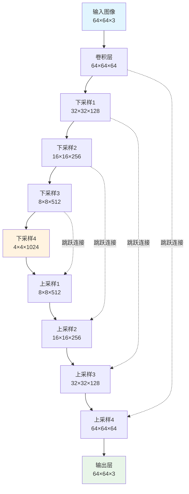

扩散模型的兴起可以看作是近年来 AI 生成艺术作品领域取得突破的主要因素。

在图像创作方面，扩散模型已成为内容生成领域的前沿技术。尽管该模型于 2015 年首次推出，但已取得显著进展，并已成为 DALLE 和 Midjourney 等知名模型的核心机制。

## 1. 通俗讲解

### 扩散

#### 物理学中的类比

想象一下一杯透明的水。如果我们加入少量其他颜色的液体，比如黄色的液体，会发生什么？黄色液体会逐渐均匀地扩散到整个玻璃杯中，最终的混合物会呈现出略带透明的黄色。

![[3.7.excalidraw|1000]]

上面的过程被称为 **正向扩散** ：我们通过添加少量其他液体来改变环境状态。然而，进行 **反向扩散** ——将混合物恢复到其原始状态——是否同样容易？事实证明并非如此。即使在最好的情况下，实现这一点也需要高度复杂的机制。

#### 将类比应用于机器学习

扩散也可以应用于图像。想象一下一张高质量的狗狗照片。我们可以通过逐渐添加随机噪声来轻松地变换这幅图像。结果，像素值会发生变化，使图像中的狗狗变得不那么明显，甚至无法辨认。这个变换过程称为 **正向扩散** 。

![[3.8.excalidraw|1000]]

我们也可以考虑反向操作：给定一张噪声图像，目标是重建原始图像。这项任务更具挑战性，因为与大量可能的噪声变化相比，可高度识别的图像状态要少得多。 用前面提到的物理类比，这个过程称为 **反向扩散** 。

在本文中，我将通过示意图来解释它的工作原理。

### 扩散模型的架构

为了更好地理解扩散模型的结构，让我们分别检查两个扩散过程。

#### 正向扩散

如前所述，前向扩散涉及逐步向图像添加噪声。然而，在实践中，这个过程要更加微妙一些。

最常见的方法是从均值为 0 的 **高斯分布** 中为图片中的每个像素采样一个随机值。然后将这个采样值（可以是正值也可以是负值）添加到像素的原始值中。对所有像素重复此操作会得到原始图像的噪声版本。

![[3.9.excalidraw|10000]]

```ad-note
所选的高斯分布通常方差较小，这意味着采样值通常较小。因此，每一步只会对图像产生微小的变化。
```

正向扩散是一个迭代过程，其中噪声被多次应用于图像。随着每次迭代，生成的图像与原始图像的差异越来越大。经过数百次迭代（这在实际扩散模型中很常见）后，图像最终变得无法从纯噪声中识别出来。

#### 反向扩散

现在你可能会问： 执行所有这些正向扩散变换的目的是什么 ？答案是，每次迭代生成的图像都用于训练神经网络。

具体来说，假设我们在正向扩散过程中应用了 100 次连续噪声变换。然后，我们可以在每一步获取图像，并训练神经网络重建上一步的图像。预测图像与实际图像之间的差异使用损失函数计算——例如均方误差 (MSE) ，它衡量两幅图像之间的平均像素差异。

![[3.10.excalidraw|10000]]

```ad-tip
该模型的目标是检测添加的噪声并重建先前的图像。然后将预测图像与实际图像进行比较以计算损失。

这个例子展示了扩散模型重构原始图像的过程。同时，扩散模型可以被训练来预测添加到图像中的噪声。在这种情况下，要重构原始图像，只需要从前一次迭代的图像中减去预测的噪声就足够了。

虽然这两个任务看起来可能相似，但预测添加的噪声比图像重构要简单。
```

![[3.11.excalidraw|10000]]

### 模型设计

在对扩散技术有了基本的了解之后，有必要探索一些更高级的概念，以更好地理解扩散模型设计。

#### 迭代次数

迭代次数是扩散模型中的关键参数之一：

```ad-note
一方面，使用更多迭代次数意味着相邻步骤中的图像对差异会更小，从而使模型的学习任务更容易。另一方面，更高的迭代次数会增加计算成本。
```

虽然较少的迭代次数可以加快训练速度，但模型可能无法学习步骤之间的平滑过渡，从而导致性能不佳。

通常，迭代次数选择在 50 到 1000 之间。

#### 神经网络架构

最常见的是，U-Net 架构被用作扩散模型的主干。以下是一些原因：

- U-Net 保留了输入和输出图像的尺寸，确保在整个逆扩散过程中图像大小保持一致。
- 其瓶颈架构能够在将整幅图像压缩到潜在空间后将其重建。同时，通过残差连接保留关键图像特征。
- U-Net 最初设计用于生物医学图像分割，其中像素级精度至关重要，它的优势可以很好地转化为需要精确预测单个像素值的扩散任务。

![[UNET架构.png]]

#### 共享网络

乍一看，似乎有必要为扩散过程的每次迭代训练一个单独的神经网络。虽然这种方法可行，并且可以产生高质量的推理结果，但从计算角度来看，它效率极低。例如，如果扩散过程包含 1000 个时间步，我们就需要训练 1000 个 U-Net 模型——这是一项极其耗时且资源密集的任务。

然而，我们可以观察到， **不同迭代中的任务配置本质上是相同的** ：在每种情况下，我们都需要重建一个尺寸相同、且经过相似幅度噪声改变的图像。这一重要洞见促成了 **在所有迭代中使用单个共享神经网络** 的想法。

实际上，这意味着我们使用一个具有共享权重的 U-Net 模型，该模型基于来自不同扩散步骤的图像对进行训练。在推理过程中，含噪图像会多次通过同一个经过训练的 U-Net 模型，逐步进行优化，直到生成高质量的图像。

![[共享模型.png]]

虽然由于仅使用单一模型，生成质量可能会略有下降，但训练速度的提升却非常显著。

## 2. 背后的数学理论

### 概述

![[Pasted image 20250903163226.png]]

扩散模型的训练可以分为两部分：

1. 正向扩散过程→给图像添加噪声。
2. 反向扩散过程→从图像中去除噪声。

### 正向扩散过程

![[Pasted image 20250903163405.png]]

![[3.1.excalidraw|10000]]

前向扩散过程逐步将高斯噪声添加到输入图像 $x_0$ 中，总共会有 $T$ 步。该过程将产生一系列带噪声的图像样本 $x_1, \dots, x_T$ 。

当 $T → ∞$ 时，最终结果将变成完全噪声图像，就像从 ==各向同性== 的高斯分布中采样出来的噪声一样。

但我们不需要设计一种算法来迭代地向图像中添加噪声，而是可以使用闭式公式（解析解）在特定的时间步长 $t$ 直接对噪声图像进行采样。

#### 闭式公式（解析解）

可以使用 **重参数化技巧** 推导出解析形式的采样公式。

首先，如果 $z\sim\mathcal{N}(\mu,\sigma^2)$ 的话，那么有下面的结论

$$
z = \mu + \sigma\epsilon \quad\text{其中}\epsilon\sim\mathcal{N}(0, 1)
$$

利用这个技巧，我们可以将采样图像 $x_t$ 表示如下：

$$
x_t = \sqrt{1-\beta_t}x_{t-1} + \sqrt{\beta_t}\epsilon_{t-1}
$$

==然后我们可以递归地展开它来得到闭合形式的公式：==

![[重参数技巧公式.png]]

```ad-tip
所有 $\epsilon$ 都是 i.i.d.（独立同分布）标准正态随机变量。

使用不同的符号和下标来区分它们非常重要，因为它们是独立的，并且在采样后它们的值可能会有所不同。
```

但是我们如何从第 4 行跳到第 5 行呢？

![[Pasted image 20250903171649.png|600]]

有些人觉得这个步骤比较难理解。我们推导一下：

![[3.2.excalidraw|1000]]

我们用 $X$ 和 $Y$ 来表示这两个项。它们可以被视为来自两个不同正态分布的样本。即

$$
X\sim\mathcal{N}(0,\alpha_t(1-\alpha_{t-1})I)
$$

和

$$
Y\sim\mathcal{N}(0,(1-\alpha_{t})I)
$$

回想一下，两个正态分布（独立）随机变量的和也是正态分布的。即，如果 $Z=X+Y$ ，那么有下面的公式

$$
Z\sim\mathcal{N}(0, \sigma^2_X+\sigma^2_Y)
$$

因此，我们可以将它们合并在一起，并以重新参数化的形式表示合并后的正态分布。这就是我们将这两个项合并的方法。

重复这些步骤将为我们提供以下仅取决于输入图像 $x_0$ 的公式：

$$
x_t = \sqrt{\overline{\alpha}_t}x_{0}+\sqrt{1-\overline{\alpha}_t}\epsilon
$$

现在我们可以使用此公式在任何时间步骤直接对 $x_t$ 进行采样，这使得前向过程更快。

### 反向扩散过程

![[3.3.excalidraw|10000]]

与前向过程不同，我们不能使用 $q(x_{t-1}|x_t)$ 来逆转噪声，因为它是难以处理的（不可计算的）。

```ad-tip
给定一张纯噪声图片（$x_t$）为条件，图片（$x_0$）是一只猫的概率是多少？无法计算。
```

因此，我们需要训练一个神经网络 $p_\theta(x_{t-1}|x_t)$ 来近似 $q(x_{t-1}|x_t)$ 。近似值 $p_\theta(x_{t-1}|x_t)$ 服从正态分布，其均值和方差如下：

$$
\begin{cases}
\mu_\theta(x_t, t) &:= \tilde{\mu}_t(x_t, x_0) \\
\Sigma_\theta(x_t, t) &:= \tilde{\beta}_t I
\end{cases}
$$

#### 损失函数

我们可以将损失定义为负对数似然：

![[3.4.excalidraw|10000]]

这里我们可以优化变分下界，而不是优化难以解决的损失函数本身。

![[3.5.excalidraw|1000]]

通过优化可计算的下界函数，我们可以间接优化难以解决的损失函数。

![[3.6.excalidraw|10000]]

==变分下界的推导与扩展==

通过扩展变分下界，我们发现它可以用以下三个项表示：

**1. 常数项** ：$L_T$

由于 $q$ 没有可学习的参数，而 $p$ 只是高斯噪声概率，因此该项在训练期间将是一个常数，因此可以忽略不计。

**2. 逐步去噪项** ：$L_{t-1}$

该项将目标去噪步骤 $q$ 与近似去噪步骤 $p_θ$ 进行比较。

```ad-tip
请注意，通过对 $x_0$ 进行条件分析，$q(x_{t-1}|x_t,x_0)$ 变得容易处理。
```

![[逐步去噪项公式推导.png]]

经过一系列推导，平均值 $\tilde{\mu}_t$ 的 $q(x_{t-1}|x_t,x_0)$ 如上所示。

平均值的推导过程见后面。

为了近似目标去噪步长 $q$ ，我们只需使用神经网络近似其均值即可。因此，我们将近似均值 $\mu_\theta$ 设置为与目标均值 $\tilde{\mu}_t$ 相同的形式（使用可学习的神经网络 $\epsilon_\theta$ ）：

![[Pasted image 20250903183630.png|600]]

可以使用均方误差（MSE）来比较目标均值和近似均值：

![[Pasted image 20250903183650.png]]

实验表明，忽略加权项并简单地计算目标噪声和预测噪声的 MSE 可以获得更好的结果。

![[3.11.excalidraw|10000]]


**3. 重建项** ：$L_0$

这是最后一步去噪的重建损失，由于以下原因，可以在训练期间忽略它：

- 它可以使用 $L_{t-1}$ 中的相同神经网络来近似。
- 忽略它会使样本质量更好，并且使其更易于实现。

#### 简化的损失函数

因此最终简化的训练目标如下：

![[简单损失函数.excalidraw|10000]]

### U-Net模型

#### 数据集

在每个 Epoch：

1. 将为每个训练样本（图像）选择一个随机时间步长 $t$ 。
2. 对每幅图像应用高斯噪声（对应于 $t$ ）。
3. 将时间步长转换为嵌入（向量）。

![[Pasted image 20250903184137.png]]

#### 训练

```ad-danger
title: 训练算法伪代码

1. **Repeat**
2. $\quad$ $\mathbf{x}_{0}\sim q(\mathbf{x}_{0})$              # 从数据集中抽取一张图片
3. $\quad$ $t\sim \text{Uniform}(\{1,\dots,T\})$               # 从均匀分布中采样一个时间步
4. $\quad$ $\epsilon\sim\mathcal{N}(0,\mathbf{I})$             # 从正态分布中采样一个噪声
5. $\quad$ 使用梯度下降法，梯度为
$$
\nabla_{\theta}\left\Vert{ \epsilon - \epsilon_{\theta}\left(\sqrt{ \overline{\alpha}_{t} }\mathbf{x}_{0}+\sqrt{ 1-\overline{\alpha}_{t} }\epsilon,t\right) }\right\Vert^{2}
$$
6. **Until** 收敛
```

官方的训练算法如上，下图是一个训练步骤的示意图：

![[扩散模型训练步骤示意图.excalidraw|10000]]

#### 反向扩散

```ad-danger
title: 采样算法

1. $\mathbf{x}_T\sim\mathcal{N}(\mathbf{0},\mathbf{I})$
2. **for** $t=T,...,1$ **do**
3. $\quad$ $\mathbf{z}\sim\mathcal{N}(\mathbf{0},\mathbf{I})$ **if** $t>1$, **else** $\mathbf{z}=\mathbf{0}$
4. $\quad$ $\mathbf{x}_{t-1}=\frac{1}{\sqrt{ \alpha_{t} }}\left( \mathbf{x}_{t}-\frac{1-\alpha_{t}}{\sqrt{  1-\overline{\alpha}_{t}}}\epsilon_{\theta}(\mathbf{x}_{t},t) \right) + \sigma_{t}\mathbf{z}$
5. **end for**
6. **return** $\mathbf{x}_0$
```

我们可以使用上述算法从噪声中生成图像。下图是它的说明：

![[扩散模型采样示意图.excalidraw|10000]]

请注意，在最后一步，我们只是输出学习到的平均值 $\mu_\theta(x_1,1)$ ，而不向其中添加噪声。

### 平均值 $\tilde{\mu}_t$ 的详细推导（选学）

以下是损失函数部分中逐步去噪项中 $q(x_{t-1}|x_t,x_0)$ 的平均值 $\tilde{\mu}_t$ 的详细推导。

![[均值推导过程.png]]

## 3. 代码实现

### 导入库

导入需要的库

```python
import torch
import torch.nn as nn
import torch.nn.functional as F
from torch import optim
from torchvision import transforms
from PIL import Image
import matplotlib.pyplot as plt
import numpy as np
import math
from typing import Optional, Sequence
from tqdm import tqdm
```

### 扩散过程相关代码

我们需要针对扩散的时间步来制定一个方差的调度计划。每个时间步，都在前面一个时间步的图像中添加一个高斯噪声。在开始向图像中添加噪声的时候，需要高斯噪声的方差小一些，不至于一开始就把图像变得很模糊。而到了后面，添加噪声就可以大胆一些了，反正已经模糊了。所以后面添加的高斯噪声需要方差大一些。

```ad-note
title: 高斯噪声的方差

公式中的 $\beta_t$ 就是第 $t$ 个时间步要添加的噪声的方差。
```

```python
def get_beta_schedule(timesteps, beta_start=1e-4, beta_end=0.02):
    """
    生成线性的beta调度表，从beta_start到beta_end，共timesteps步

    Args:
        timesteps: 时间步数量
        beta_start: 起始β值
        beta_end: 结束β值

    Returns:
        torch.Tensor: beta调度表
    """
    return torch.linspace(beta_start, beta_end, timesteps)
```

由于我们已经使用重参数技巧来给图像添加噪声，也就是通过解析解可以直接得到添加了 $t$ 个时间步的噪声的图像。所以前向扩散过程就用了这个公式。

````ad-note
title: 直接从 $x_0$ 采样到任意时间步 $x_t$

```ad-tip
$x_t = \sqrt{\bar{\alpha}_t}x_0 + \sqrt{1-\bar{\alpha}_t}\epsilon$

其中：
- $\alpha_t = 1 - \beta_t$
- $\bar{\alpha}_t = \prod_{s=1}^t \alpha_s$
- $\sqrt{\bar{\alpha}_t}\rightarrow$ `sqrt_alphas_cumprod[t].view(-1, 1, 1, 1)`
- $\sqrt{1-\bar{\alpha}_t}\rightarrow$ `sqrt_one_minus_alphas_cumprod[t].view(-1, 1, 1, 1)`
- $\epsilon \sim \mathcal{N}(0, I)\rightarrow$ `noise = torch.randn_like(x_0)`
- $x_t\rightarrow$ `x_t = sqrt_alpha_cumprod_t * x_0 + sqrt_one_minus_alpha_cumprod_t * noise`
```
````

公式和代码基本是对应的。

```python
def forward_diffusion_sample(
	x_0, # 原始图像
	t, # 时间步
	sqrt_alphas_cumprod, # 图像保留比例
	sqrt_one_minus_alphas_cumprod # 噪声比例
):
    """
    前向扩散过程：给原始图像x_0添加噪声，得到时间步t的噪声图像x_t

    Args:
        x_0: 原始清晰图像
        t: 时间步
        sqrt_alphas_cumprod: sqrt(alpha_bar_t)，图像保留比例
        sqrt_one_minus_alphas_cumprod: sqrt(1-alpha_bar_t)，噪声比例

    Returns:
        x_t: 噪声图像
        noise: 添加的噪声
    """
    # 生成与输入图像相同形状的高斯噪声
    noise = torch.randn_like(x_0)

    # 获取当前时间步的缩放因子，调整维度以匹配图像(B,C,H,W)
    sqrt_alpha_cumprod_t = sqrt_alphas_cumprod[t].view(-1, 1, 1, 1)
    sqrt_one_minus_alpha_cumprod_t = sqrt_one_minus_alphas_cumprod[t].view(
        -1, 1, 1, 1)

    # 应用扩散公式: x_t = sqrt(alpha_bar_t) * x_0 + sqrt(1-alpha_bar_t) * noise
    x_t = sqrt_alpha_cumprod_t * x_0 + sqrt_one_minus_alpha_cumprod_t * noise
    return x_t, noise
```

接下来编写反向去噪过程的代码，也就是从 $x_t$ 预测 $x_{t-1}$ 。

![[3.11.excalidraw|10000]]

给定了时间步和添加噪声的图像，模型可以预测出这幅图片中的噪声有多少，那么我们从 $x_t$ 中将预测出的噪声减掉，就可以去噪了！

```python
@torch.no_grad()
def denoising_step(x_t, t, model, alphas, alphas_cumprod, betas):
    """
    反向去噪过程：从x_t预测x_{t-1}

    Args:
        x_t: 当前时间步的噪声图像xₜ
        t: 当前时间步
        model: 训练好的UNet模型
        alphas: alpha调度表
        alphas_cumprod: alpha累积乘积
        betas: beta调度表

    Returns:
        x_{t-1}: 去噪后的图像
    """
    # 使用模型预测噪声
    predicted_noise = model(x_t, t)

    # 获取当前时间步的参数，调整维度匹配图像
    alpha_t = alphas[t].view(-1, 1, 1, 1)
    beta_t = betas[t].view(-1, 1, 1, 1)
    alpha_bar_t = alphas_cumprod[t].view(-1, 1, 1, 1)

    # 计算噪声的标准差
    sigma_t = torch.sqrt(beta_t)

    # 应用DDPM反向采样公式计算均值
    mean = (1.0 / torch.sqrt(alpha_t)) * (
        x_t - ((1.0 - alpha_t) / torch.sqrt(1.0 - alpha_bar_t)) * predicted_noise
    )

    # 如果不是最后一步，添加随机噪声；最后一步输出确定性结果
    if t[0] > 0:
        z = torch.randn_like(x_t)
        return mean + sigma_t * z
    else:
        return mean
```

![[Pasted image 20250903184406.png]]

上面的代码实现了伪代码中的第 4 步。

### 时间步位置编码

由于训练网络需要时间步的信息，所以我们需要将时间步进行编码然后注入到网络中。

时间步信息通过正弦位置编码注入网络：

$$\text{PE}(t, 2i) = \sin\left(\frac{t}{10000^{2i/d}}\right)$$
$$\text{PE}(t, 2i+1) = \cos\left(\frac{t}{10000^{2i/d}}\right)$$

可以看到编码方式和 Transformer 中的几乎一样。

```python
class TimePositionalEncoding(nn.Module):
    """
    计算正弦位置编码，用于时间步嵌入
    类似Transformer中的位置编码：
        PE[t, 2i]   = sin(t / 10000^{2i/d})
        PE[t, 2i+1] = cos(t / 10000^{2i/d})
    """

    def __init__(self, dim: int):
        """
        Args:
            dim: 嵌入维度（必须是偶数）
        """
        super().__init__()
        self.dim = dim

    def forward(self, timesteps: torch.Tensor) -> torch.Tensor:
        """
        Args:
            timesteps: 形状为(batch,)的时间步张量

        Returns:
            形状为(batch, dim)的正弦嵌入
        """
        device = timesteps.device
        half_dim = self.dim // 2

        # 计算指数衰减因子
        scale = math.log(10000) / (half_dim - 1)
        exponents = torch.exp(torch.arange(half_dim, device=device) * -scale)

        # 计算正弦和余弦值
        args = timesteps[:, None] * exponents[None, :]
        emb = torch.cat([args.sin(), args.cos()], dim=-1)

        return emb
```

### U-Net神经网络



先来编写 U-Net 的单个编码器或者解码器阶段。

```python
class UNetStage(nn.Module):
    """
    UNet的单个编码器或解码器阶段

    下采样阶段: (B, C_in, H, W) -> (B, C_out, H/2, W/2)
    上采样阶段: (B, 2*C_in, H, W) -> (B, C_out, 2H, 2W)
    """

    def __init__(
        self,
        in_ch: int,
        out_ch: int,
        time_dim: int,
        use_label_cond: bool = False,
        kernel_size: int = 3,
        downsample: bool = True
    ):
        """
        Args:
            in_ch: 输入通道数
            out_ch: 输出通道数
            time_dim: 时间嵌入维度
            use_label_cond: 是否使用标签条件
            kernel_size: 卷积核大小
            downsample: True为下采样，False为上采样
        """
        super().__init__()

        self.use_label_cond = use_label_cond
        self.is_down = downsample

        # 时间步编码器
        self.time_encoder = TimePositionalEncoding(time_dim)
        self.time_proj = nn.Linear(time_dim, out_ch)

        # 标签条件投影（如果启用）
        if use_label_cond:
            self.label_proj = nn.Linear(1, out_ch)

        # 卷积层
        if downsample:
            # 下采样：保持空间尺寸 -> 缩小空间尺寸
            self.conv_in = nn.Conv2d(in_ch, out_ch, kernel_size, padding=1)
            self.spatial = nn.Conv2d(out_ch, out_ch, 4, stride=2, padding=1)
        else:
            # 上采样：连接跳跃连接，因此输入通道翻倍
            self.conv_in = nn.Conv2d(2 * in_ch, out_ch, kernel_size, padding=1)
            self.spatial = nn.ConvTranspose2d(
                out_ch, out_ch, 4, stride=2, padding=1)

        # 批归一化和激活函数
        self.bn1 = nn.BatchNorm2d(out_ch)
        self.bn2 = nn.BatchNorm2d(out_ch)
        self.conv_feat = nn.Conv2d(out_ch, out_ch, 3, padding=1)
        self.act = nn.ReLU()

    def forward(self, x: torch.Tensor, timesteps: torch.Tensor,
                labels: Optional[torch.Tensor] = None) -> torch.Tensor:
        """
        Args:
            x: 输入特征图
            timesteps: 时间步张量，形状(B,)
            labels: 标签张量，形状(B, 1)（如果启用标签条件）

        Returns:
            变换后的特征图
        """
        # 第一个卷积层
        out = self.bn1(self.act(self.conv_in(x)))

        # 添加时间嵌入
        t_emb = self.act(self.time_proj(self.time_encoder(timesteps)))
        out = out + t_emb[..., None, None]

        # 添加标签嵌入（如果启用）
        if self.use_label_cond:
            if labels is None:
                raise ValueError("启用了标签条件但未提供标签")
            lbl_emb = self.act(self.label_proj(labels))
            out = out + lbl_emb[..., None, None]

        # 第二个卷积层和空间变换
        out = self.bn2(self.act(self.conv_feat(out)))
        return self.spatial(out)
```

完整的 U-Net 结果如下

```python
class DiffusionUNet(nn.Module):
    """
    用于扩散模型的UNet架构
    支持时间步条件和可选的标签条件
    """

    def __init__(
        self,
        img_channels: int = 3,
        time_dim: int = 128,
        label_conditioning: bool = False,
        channel_sequence: Sequence[int] = (64, 128, 256, 512, 1024)
    ):
        """
        Args:
            img_channels: 输入/输出图像通道数
            time_dim: 时间步嵌入维度
            label_conditioning: 是否启用标签条件
            channel_sequence: 特征通道宽度序列
        """
        super().__init__()

        self.time_dim = time_dim
        self.label_conditioning = label_conditioning

        # 输入卷积层
        self.stem = nn.Conv2d(img_channels, channel_sequence[0], 3, padding=1)

        # 下采样路径（编码器）
        self.down_blocks = nn.ModuleList([
            UNetStage(c_in, c_out, time_dim,
                      label_conditioning, downsample=True)
            for c_in, c_out in zip(channel_sequence, channel_sequence[1:])
        ])

        # 上采样路径（解码器）
        rev_channels = channel_sequence[::-1]
        self.up_blocks = nn.ModuleList([
            UNetStage(c_in, c_out, time_dim,
                      label_conditioning, downsample=False)
            for c_in, c_out in zip(rev_channels, rev_channels[1:])
        ])

        # 输出投影层
        self.head = nn.Conv2d(channel_sequence[0], img_channels, 1)

    def forward(self, x: torch.Tensor, timesteps: torch.Tensor,
                labels: Optional[torch.Tensor] = None) -> torch.Tensor:
        """
        Args:
            x: 输入图像批次，形状(B, C, H, W)
            timesteps: 时间步索引，形状(B,)
            labels: 标签张量，形状(B, 1)（如果启用标签条件）

        Returns:
            与输入x相同形状的输出张量
        """
        skips = []
        h = self.stem(x)

        # 编码器路径（存储跳跃连接）
        for down in self.down_blocks:
            h = down(h, timesteps, labels=labels)
            skips.append(h)

        # 解码器路径（使用反向的跳跃连接）
        for up, skip in zip(self.up_blocks, reversed(skips)):
            h = up(torch.cat([h, skip], dim=1), timesteps, labels=labels)

        return self.head(h)
```

### 可视化函数

```python
def plot_noise_distribution(noise, predicted_noise):
    """绘制真实噪声和预测噪声的分布对比"""
    plt.figure(figsize=(10, 6))
    plt.hist(noise.cpu().numpy().flatten(), density=True,
             alpha=0.7, label="真实噪声", bins=50)
    plt.hist(predicted_noise.cpu().numpy().flatten(), density=True,
             alpha=0.7, label="预测噪声", bins=50)
    plt.xlabel("噪声值")
    plt.ylabel("密度")
    plt.title("噪声分布对比")
    plt.legend()
    plt.grid(True, alpha=0.3)
    plt.show()


def plot_noise_prediction(noise, predicted_noise):
    """并排显示真实噪声和预测噪声"""
    fig, axes = plt.subplots(1, 2, figsize=(10, 5))

    # 转换为可显示的格式
    def tensor_to_image(tensor):
        img = (tensor + 1) / 2  # 从[-1,1]缩放到[0,1]
        img = img.permute(1, 2, 0)  # CHW到HWC
        img = torch.clamp(img, 0, 1)
        return img.cpu().numpy()

    axes[0].imshow(tensor_to_image(noise))
    axes[0].set_title("真实噪声")
    axes[0].axis('off')

    axes[1].imshow(tensor_to_image(predicted_noise))
    axes[1].set_title("预测噪声")
    axes[1].axis('off')

    plt.tight_layout()
    plt.show()


def plot_generation_process(generated_images):
    """显示生成过程的中间结果"""
    fig, axes = plt.subplots(1, len(generated_images),
                             figsize=(len(generated_images) * 3, 3))
    if len(generated_images) == 1:
        axes = [axes]

    for ax, (step, image) in zip(axes, generated_images):
        ax.imshow(image)
        ax.set_title(f"步骤 {step}")
        ax.axis("off")

    plt.tight_layout()
    plt.show()
```

### 主训练和生成代码

```python
def main():
    """主函数：训练模型并生成图像"""

    # 设备配置
    device = torch.device("cuda" if torch.cuda.is_available() else "cpu")
    print(f"使用设备: {device}")

    # 超参数
    T = 1000  # 扩散步数T
    IMAGE_SHAPE = (48, 48)  # 图像尺寸
    LR = 0.001  # 学习率
    NO_EPOCHS = 1000  # 训练轮数
    BATCH_SIZE = 256  # 批次大小
    PRINT_FREQUENCY = 10  # 打印频率
    VERBOSE = False  # 是否显示详细信息

    # 图像预处理
    transform = transforms.Compose([
        transforms.Resize(IMAGE_SHAPE),
        transforms.ToTensor(),
        transforms.Lambda(lambda t: (t * 2) - 1),  # 缩放到[-1, 1]
    ])

    # 加载图像
    photo_path = "image.jpg"  # 替换为你的图像路径
    image = Image.open(photo_path)
    transformed_image = transform(image).to(device)
    print(f"成功加载图像: {photo_path}")

    # 初始化扩散调度表
    betas = get_beta_schedule(T).to(device)
    alphas = (1. - betas).to(device)
    alphas_cumprod = torch.cumprod(alphas, dim=0).to(device)
    sqrt_alphas_cumprod = torch.sqrt(alphas_cumprod).to(device)
    sqrt_one_minus_alphas_cumprod = torch.sqrt(1 - alphas_cumprod).to(device)

    # 初始化模型和优化器
    unet = DiffusionUNet(img_channels=3, label_conditioning=False).to(device)
    optimizer = optim.Adam(unet.parameters(), lr=LR)

    print(f"模型参数数量: {sum(p.numel() for p in unet.parameters()):,}")

    # 训练循环
    print("开始训练...")
    unet.train()

    for epoch in range(NO_EPOCHS):
        # 创建批次数据
        batch = torch.stack([transformed_image] * BATCH_SIZE)
        t = torch.randint(0, T, (BATCH_SIZE,), device=device).long()

        # 前向扩散：添加噪声
        batch_noisy, noise = forward_diffusion_sample(
            batch, t, sqrt_alphas_cumprod, sqrt_one_minus_alphas_cumprod
        )

        # 模型预测噪声
        predicted_noise = unet(batch_noisy, t)

        # 计算损失并更新参数
        optimizer.zero_grad()
        loss = F.mse_loss(noise, predicted_noise)
        loss.backward()
        optimizer.step()

        # 打印训练信息
        if epoch % PRINT_FREQUENCY == 0:
            print(f"轮次 {epoch:4d} | 训练损失: {loss.item():.6f}")

    print("训练完成！")

    # 生成新图像
    print("开始生成图像...")
    generated_images = []
    show_every = 100  # 每隔多少步保存一次中间结果

    with torch.no_grad():
        unet.eval()
        # 从纯噪声开始
        img = torch.randn((1, 3) + IMAGE_SHAPE).to(device)

        # 逐步去噪
        for i in tqdm(reversed(range(T)), desc="去噪进度"):
            t_tensor = torch.full((1,), i, dtype=torch.long, device=device)
            img = denoising_step(img, t_tensor, unet,
                                 alphas, alphas_cumprod, betas)

            # 保存中间结果
            if i % show_every == 0 or i == 0:
                # 转换为PIL图像
                img_display = (img[0] + 1) / 2  # 从[-1,1]到[0,1]
                img_display = torch.clamp(img_display, 0, 1)
                img_display = img_display.permute(1, 2, 0).cpu().numpy()
                img_display = (img_display * 255).astype(np.uint8)
                img_pil = Image.fromarray(img_display)

                generated_images.append((T - i, img_pil))

    # 显示生成过程
    print("显示生成过程...")
    generated_images.sort()
    plot_generation_process(generated_images)

    # 保存最终生成的图像
    final_image = generated_images[-1][1]
    final_image.save("generated_image.png")
    print("最终生成的图像已保存为 'generated_image.png'")


if __name__ == "__main__":
    main()
```

