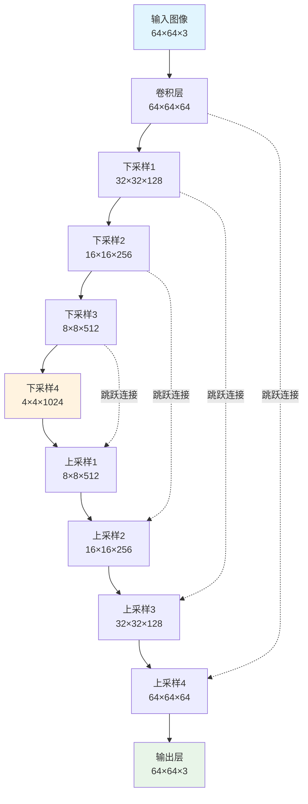

扩散模型的兴起可以看作是近年来 AI 生成艺术作品领域取得突破的主要因素。

在图像创作方面，扩散模型已成为内容生成领域的前沿技术。尽管该模型于 2015 年首次推出，但已取得显著进展，并已成为 DALLE 和 Midjourney 等知名模型的核心机制。

## 1. 通俗讲解

### 扩散

#### 物理学中的类比

想象一下一杯透明的水。如果我们加入少量其他颜色的液体，比如黄色的液体，会发生什么？黄色液体会逐渐均匀地扩散到整个玻璃杯中，最终的混合物会呈现出略带透明的黄色。

![[3.7.excalidraw|1000]]

上面的过程被称为 **正向扩散** ：我们通过添加少量其他液体来改变环境状态。然而，进行 **反向扩散** ——将混合物恢复到其原始状态——是否同样容易？事实证明并非如此。即使在最好的情况下，实现这一点也需要高度复杂的机制。

#### 将类比应用于机器学习

扩散也可以应用于图像。想象一下一张高质量的狗狗照片。我们可以通过逐渐添加随机噪声来轻松地变换这幅图像。结果，像素值会发生变化，使图像中的狗狗变得不那么明显，甚至无法辨认。这个变换过程称为 **正向扩散** 。

![[3.8.excalidraw|1000]]

我们也可以考虑反向操作：给定一张噪声图像，目标是重建原始图像。这项任务更具挑战性，因为与大量可能的噪声变化相比，可高度识别的图像状态要少得多。 用前面提到的物理类比，这个过程称为 **反向扩散** 。

在本文中，我将通过示意图来解释它的工作原理。

### 扩散模型的架构

为了更好地理解扩散模型的结构，让我们分别检查两个扩散过程。

#### 正向扩散

如前所述，前向扩散涉及逐步向图像添加噪声。然而，在实践中，这个过程要更加微妙一些。

最常见的方法是从均值为 0 的 **高斯分布** 中为图片中的每个像素采样一个随机值。然后将这个采样值（可以是正值也可以是负值）添加到像素的原始值中。对所有像素重复此操作会得到原始图像的噪声版本。

![[3.9.excalidraw|10000]]

```ad-note
所选的高斯分布通常方差较小，这意味着采样值通常较小。因此，每一步只会对图像产生微小的变化。
```

正向扩散是一个迭代过程，其中噪声被多次应用于图像。随着每次迭代，生成的图像与原始图像的差异越来越大。经过数百次迭代（这在实际扩散模型中很常见）后，图像最终变得无法从纯噪声中识别出来。

#### 反向扩散

现在你可能会问： 执行所有这些正向扩散变换的目的是什么 ？答案是，每次迭代生成的图像都用于训练神经网络。

具体来说，假设我们在正向扩散过程中应用了 100 次连续噪声变换。然后，我们可以在每一步获取图像，并训练神经网络重建上一步的图像。预测图像与实际图像之间的差异使用损失函数计算——例如均方误差 (MSE) ，它衡量两幅图像之间的平均像素差异。

![[3.10.excalidraw|10000]]

```ad-tip
该模型的目标是检测添加的噪声并重建先前的图像。然后将预测图像与实际图像进行比较以计算损失。

这个例子展示了扩散模型重构原始图像的过程。同时，扩散模型可以被训练来预测添加到图像中的噪声。在这种情况下，要重构原始图像，只需要从前一次迭代的图像中减去预测的噪声就足够了。

虽然这两个任务看起来可能相似，但预测添加的噪声比图像重构要简单。
```

![[3.11.excalidraw|10000]]

### 模型设计

在对扩散技术有了基本的了解之后，有必要探索一些更高级的概念，以更好地理解扩散模型设计。

#### 迭代次数

迭代次数是扩散模型中的关键参数之一：

```ad-note
一方面，使用更多迭代次数意味着相邻步骤中的图像对差异会更小，从而使模型的学习任务更容易。另一方面，更高的迭代次数会增加计算成本。
```

虽然较少的迭代次数可以加快训练速度，但模型可能无法学习步骤之间的平滑过渡，从而导致性能不佳。

通常，迭代次数选择在 50 到 1000 之间。

#### 神经网络架构

最常见的是，U-Net 架构被用作扩散模型的主干。以下是一些原因：

- U-Net 保留了输入和输出图像的尺寸，确保在整个逆扩散过程中图像大小保持一致。
- 其瓶颈架构能够在将整幅图像压缩到潜在空间后将其重建。同时，通过残差连接保留关键图像特征。
- U-Net 最初设计用于生物医学图像分割，其中像素级精度至关重要，它的优势可以很好地转化为需要精确预测单个像素值的扩散任务。

![[UNET架构.png]]

#### 共享网络

乍一看，似乎有必要为扩散过程的每次迭代训练一个单独的神经网络。虽然这种方法可行，并且可以产生高质量的推理结果，但从计算角度来看，它效率极低。例如，如果扩散过程包含 1000 个时间步，我们就需要训练 1000 个 U-Net 模型——这是一项极其耗时且资源密集的任务。

然而，我们可以观察到， **不同迭代中的任务配置本质上是相同的** ：在每种情况下，我们都需要重建一个尺寸相同、且经过相似幅度噪声改变的图像。这一重要洞见促成了 **在所有迭代中使用单个共享神经网络** 的想法。

实际上，这意味着我们使用一个具有共享权重的 U-Net 模型，该模型基于来自不同扩散步骤的图像对进行训练。在推理过程中，含噪图像会多次通过同一个经过训练的 U-Net 模型，逐步进行优化，直到生成高质量的图像。

![[共享模型.png]]

虽然由于仅使用单一模型，生成质量可能会略有下降，但训练速度的提升却非常显著。

## 2. 扩散模型理论简介

### 概述

![[正向扩散和逆向扩散.png]]

扩散模型的训练可以分为两部分：

1. 正向扩散过程→给图像添加噪声。
2. 反向扩散过程→从图像中去除噪声。

### 正向扩散过程

![[3.1.excalidraw|10000]]

前向扩散过程逐步将高斯噪声添加到输入图像 $x_0$ 中，总共会有 $T$ 步。该过程将产生一系列带噪声的图像样本 $x_1, \dots, x_T$ 。

当 $T → ∞$ 时，最终结果将变成完全噪声图像，就像从 ==各向同性== 的高斯分布中采样出来的噪声一样。

首先，如果 $z\sim\mathcal{N}(\mu,\sigma^2)$ 的话，那么正态分布可以写成如下公式：

$$
z = \mu + \sigma\epsilon \quad\text{其中}\epsilon\sim\mathcal{N}(0, 1)
$$

利用这个技巧，我们可以将采样图像 $x_t$ 表示如下：

$$
x_t = \sqrt{1-\beta_t}x_{t-1} + \sqrt{\beta_t}\epsilon_{t-1}
$$

```ad-danger
title: 一步一步的添加噪声太麻烦了！

根据上面的公式，如果想要从原始图片 $x_0$ 得到添加了 500 步噪声的图片 $x_{500}$ 需要迭代 500 次！
```

但我们不需要设计一种算法来迭代地向图像中添加噪声，而是可以使用闭式公式（解析解）在特定的时间步长 $t$ 直接对噪声图像进行采样。

给定原始图片 $x_0$ 和时间步 $t$ 可以直接得到添加了 $t$ 步噪声的图像 $x_t$ 。公式如下：

```ad-tip
title: 给定原始图片 $x_0$ 和时间步 $t$ 直接采样出 $x_t$ 的公式

$$
x_t = \sqrt{\overline{\alpha}_t}x_{0}+\sqrt{1-\overline{\alpha}_t}\epsilon
$$

其中：
- $\overline{\alpha}_t = \alpha_t\alpha_{t-1}\cdots\alpha_1$
- $\alpha_t = 1-\beta_t$
- $\epsilon\sim\mathcal{N}(0,1)$
```

现在我们可以使用此公式在任何时间步骤直接对 $x_t$ 进行采样，这使得前向过程更快。

### 反向扩散过程

反向扩散过程是从一张完全的高斯噪声图片中，逐步去除噪声，来生成一张图片。这个逆向过程很难，相当于一滴墨水在水里面扩散开来（正向扩散），想要将变黑的水逆向为原来的墨水刚滴入水中时的状态。这几乎不可能做到，所以我们用神经网络来解决这个问题。下面是训练神经网络的原理。

![[3.11.excalidraw|10000]]

因此最终的训练目标如下：

![[简单损失函数.excalidraw|10000]]

### U-Net模型

#### 数据集

在每个 Epoch：

1. 将为每个训练样本（图像）选择一个随机时间步长 $t$ 。
2. 对每幅图像应用高斯噪声（对应于 $t$ ）。
3. 将时间步长转换为嵌入（向量）。

![[unet训练步骤.png]]

#### 训练

```ad-danger
title: 训练算法伪代码

1. **Repeat**
2. $\quad$ $\mathbf{x}_{0}\sim q(\mathbf{x}_{0})$              # 从数据集中抽取一张图片
3. $\quad$ $t\sim \text{Uniform}(\{1,\dots,T\})$               # 从均匀分布中采样一个时间步
4. $\quad$ $\epsilon\sim\mathcal{N}(0,\mathbf{I})$             # 从正态分布中采样一个噪声
5. $\quad$ 使用梯度下降法，梯度为
$$
\nabla_{\theta}\left\Vert{ \epsilon - \epsilon_{\theta}\left(\sqrt{ \overline{\alpha}_{t} }\mathbf{x}_{0}+\sqrt{ 1-\overline{\alpha}_{t} }\epsilon,t\right) }\right\Vert^{2}
$$
6. **Until** 收敛
```

官方的训练算法如上，下图是一个训练步骤的示意图：

![[扩散模型训练步骤示意图.excalidraw|10000]]

#### 反向扩散

```ad-danger
title: 采样算法

1. $\mathbf{x}_T\sim\mathcal{N}(\mathbf{0},\mathbf{I})$
2. **for** $t=T,...,1$ **do**
3. $\quad$ $\mathbf{z}\sim\mathcal{N}(\mathbf{0},\mathbf{I})$ **if** $t>1$, **else** $\mathbf{z}=\mathbf{0}$
4. $\quad$ $\mathbf{x}_{t-1}=\frac{1}{\sqrt{ \alpha_{t} }}\left( \mathbf{x}_{t}-\frac{1-\alpha_{t}}{\sqrt{  1-\overline{\alpha}_{t}}}\epsilon_{\theta}(\mathbf{x}_{t},t) \right) + \sigma_{t}\mathbf{z}$
5. **end for**
6. **return** $\mathbf{x}_0$
   
其中，$σ_t$ 一般取 $\sqrt{β_t}$
```

我们可以使用上述算法从噪声中生成图像。下图是它的说明：

![[扩散模型采样示意图.excalidraw|10000]]

请注意，在最后一步，我们只是输出学习到的平均值 $\mu_\theta(x_1,1)$ ，而不向其中添加噪声。

## 3. 代码实现

### 扩散过程相关代码

我们需要针对扩散的时间步来制定一个方差的调度计划。每个时间步，都在前面一个时间步的图像中添加一个高斯噪声。在开始向图像中添加噪声的时候，需要高斯噪声的方差小一些，不至于一开始就把图像变得很模糊。而到了后面，添加噪声就可以大胆一些了，反正已经模糊了。所以后面添加的高斯噪声需要方差大一些。

```ad-note
title: 高斯噪声的方差

公式中的 $\beta_t$ 就是第 $t$ 个时间步要添加的噪声的方差。
```

在代码中如下

```python
# beta_start: 起始β值，论文中等于0.0001
# beta_end: 结束β值，论文中等于0.02
# num_timesteps: 时间步的数量
# self.betas: 方差计划调度表
self.betas = torch.linspace(beta_start, beta_end, num_timesteps, device=device)
```

而由于 $α_{t}=1-\beta_{t}$ ，所以有如下代码

```python
self.alphas = 1 - self.betas
```

这样就计算出了每个时间步的 $α_t$ 。

而由于 $\bar{\alpha}_{t}=\prod_{s=1}^t\alpha_{s}$ ，所以使用 `torch.cumprod` 来计算

```python
self.alpha_bars = torch.cumprod(self.alphas, dim=0)
```

由于我们已经使用重参数技巧来给图像添加噪声，也就是通过解析解可以直接得到添加了 $t$ 个时间步的噪声的图像。所以前向扩散过程就用了这个公式。

````ad-note
title: 直接从 $x_0$ 采样到任意时间步 $x_t$

```ad-tip
$x_t = \sqrt{\bar{\alpha}_t}x_0 + \sqrt{1-\bar{\alpha}_t}\epsilon$

其中：
- $\alpha_t = 1 - \beta_t$
- $\bar{\alpha}_t = \prod_{s=1}^t \alpha_s$
- $\epsilon \sim \mathcal{N}(0, I)$
```
````

公式和代码基本是对应的。

```python
def add_noise(self, x_0, t):
    # 时间步的数量
    T = self.num_timesteps
    # 确保 1 <= t <= T
    assert (t >= 1).all() and (t <= T).all()

    t_idx = t - 1  # alpha_bars[0] is for t=1
    # a̅ₜ
    alpha_bar = self.alpha_bars[t_idx]  # (N,)
    N = alpha_bar.size(0)
    alpha_bar = alpha_bar.view(N, 1, 1, 1)  # (N, 1, 1, 1)
    # 噪声ε∼N(0,I)
    noise = torch.randn_like(x_0, device=self.device)
    # xₜ = a̅ₜ的平方根 乘以 x₀ + (1-a̅ₜ)的平方根 乘以 噪声ε
    x_t = torch.sqrt(alpha_bar) * x_0 + torch.sqrt(1 - alpha_bar) * noise
    return x_t, noise
```

接下来编写反向去噪过程的代码，也就是从 $x_t$ 预测 $x_{t-1}$ 。

![[3.11.excalidraw|10000]]

给定了时间步和添加噪声的图像，模型可以预测出这幅图片中的噪声有多少，那么我们从 $x_t$ 中将预测出的噪声减掉，就可以去噪了！

```python
def denoise(self, model, x, t):
	T = self.num_timesteps
	assert (t >= 1).all() and (t <= T).all()

	t_idx = t - 1  # alphas[0] is for t=1
	alpha = self.alphas[t_idx] # αₜ
	alpha_bar = self.alpha_bars[t_idx] # a̅ₜ
	alpha_bar_prev = self.alpha_bars[t_idx-1] # a̅ₜ₋₁

	N = alpha.size(0)
	alpha = alpha.view(N, 1, 1, 1)
	alpha_bar = alpha_bar.view(N, 1, 1, 1)
	alpha_bar_prev = alpha_bar_prev.view(N, 1, 1, 1)

	model.eval()
	with torch.no_grad():
		eps = model(x, t) # 根据时间步和图像xₜ预测噪声
	model.train()
	# 公式中的z
	noise = torch.randn_like(x, device=self.device)
	noise[t == 1] = 0  # no noise at t=1
	# 均值
	mu = (x - ((1-alpha) / torch.sqrt(1-alpha_bar)) * eps) / torch.sqrt(alpha)
	# 标准差
	std = torch.sqrt((1-alpha) * (1-alpha_bar_prev) / (1-alpha_bar))
	return mu + noise * std
```

```ad-danger
title: 采样算法

1. $\mathbf{x}_T\sim\mathcal{N}(\mathbf{0},\mathbf{I})$
2. **for** $t=T,...,1$ **do**
3. $\quad$ $\mathbf{z}\sim\mathcal{N}(\mathbf{0},\mathbf{I})$ **if** $t>1$, **else** $\mathbf{z}=\mathbf{0}$
4. $\quad$ $\mathbf{x}_{t-1}=\frac{1}{\sqrt{ \alpha_{t} }}\left( \mathbf{x}_{t}-\frac{1-\alpha_{t}}{\sqrt{  1-\overline{\alpha}_{t}}}\epsilon_{\theta}(\mathbf{x}_{t},t) \right) + \sigma_{t}\mathbf{z}$
5. **end for**
6. **return** $\mathbf{x}_0$
   
其中，$σ_t$ 在DDPM论文中是 $\sigma_{t} = \sqrt{ \frac{(1-\alpha_{t})(1-\bar{\alpha}_{t-1})}{1-\bar{\alpha}_{t}} }$
```

上面的代码实现了伪代码中的第 4 步。

其中

```python
mu = (x - ((1-alpha) / torch.sqrt(1-alpha_bar)) * eps) / torch.sqrt(alpha)
```

实现的是均值 $\mu_{\theta}(x_{t},t)$

$$
\mu_{\theta}(x_{t},t) = \frac{1}{\sqrt{ \alpha_{t} }}\left( \mathbf{x}_{t} - \frac{1-\alpha_{t}}{\sqrt{ 1-\bar{\alpha}_{t} }}\epsilon_{\theta}(\mathbf{x}_{t},t) \right) 
$$

```python
std = torch.sqrt((1-alpha) * (1-alpha_bar_prev) / (1-alpha_bar))
```

实现的是标准差 $\sigma_{t}$ 。

$$
\sigma_{t} = \sqrt{ \frac{(1-\alpha_{t})(1-\bar{\alpha}_{t-1})}{1-\bar{\alpha}_{t}} }
$$
### 时间步位置编码

由于训练网络需要时间步的信息，所以我们需要将时间步进行编码然后注入到网络中。

时间步信息通过正弦位置编码注入网络：

$$\text{PE}(t, 2i) = \sin\left(\frac{t}{10000^{2i/d}}\right)$$
$$\text{PE}(t, 2i+1) = \cos\left(\frac{t}{10000^{2i/d}}\right)$$

可以看到编码方式和Transformer中的几乎一样。

```python
def _pos_encoding(time_idx, output_dim, device='cpu'):
    t, D = time_idx, output_dim
    v = torch.zeros(D, device=device)

    i = torch.arange(0, D, device=device)
    div_term = torch.exp(i / D * math.log(10000))

    v[0::2] = torch.sin(t / div_term[0::2])
    v[1::2] = torch.cos(t / div_term[1::2])
    return v

def pos_encoding(timesteps, output_dim, device='cpu'):
    batch_size = len(timesteps)
    device = timesteps.device
    v = torch.zeros(batch_size, output_dim, device=device)
    for i in range(batch_size):
        v[i] = _pos_encoding(timesteps[i], output_dim, device)
    return v
```

### U-Net神经网络



先来编写卷积块。

```python
class ConvBlock(nn.Module):
    def __init__(self, in_ch, out_ch, time_embed_dim):
        super().__init__()
        self.convs = nn.Sequential(
            nn.Conv2d(in_ch, out_ch, 3, padding=1),
            nn.BatchNorm2d(out_ch),
            nn.ReLU(),
            nn.Conv2d(out_ch, out_ch, 3, padding=1),
            nn.BatchNorm2d(out_ch),
            nn.ReLU()
        )
        self.mlp = nn.Sequential(
            nn.Linear(time_embed_dim, in_ch),
            nn.ReLU(),
            nn.Linear(in_ch, in_ch)
        )

    def forward(self, x, v):
        N, C, _, _ = x.shape
        v = self.mlp(v)
        v = v.view(N, C, 1, 1)
        y = self.convs(x + v)
        return y
```

完整的 U-Net 结果如下

```python
class UNet(nn.Module):
    def __init__(self, in_ch=1, time_embed_dim=100):
        super().__init__()
        self.time_embed_dim = time_embed_dim

        self.down1 = ConvBlock(in_ch, 64, time_embed_dim)
        self.down2 = ConvBlock(64, 128, time_embed_dim)
        self.bot1 = ConvBlock(128, 256, time_embed_dim)
        self.up2 = ConvBlock(128 + 256, 128, time_embed_dim)
        self.up1 = ConvBlock(128 + 64, 64, time_embed_dim)
        self.out = nn.Conv2d(64, in_ch, 1)

        self.maxpool = nn.MaxPool2d(2)
        self.upsample = nn.Upsample(scale_factor=2, mode='bilinear')

    def forward(self, x, timesteps):
        v = pos_encoding(timesteps, self.time_embed_dim, x.device)

        x1 = self.down1(x, v) # 下采样
        x = self.maxpool(x1) # 最大池化
        x2 = self.down2(x, v) # 下采样
        x = self.maxpool(x2) # 最大池化

        x = self.bot1(x, v)

        x = self.upsample(x) # 上采样
        x = torch.cat([x, x2], dim=1) # 跳跃连接
        x = self.up2(x, v) # 上采样
        x = self.upsample(x) # 上采样
        x = torch.cat([x, x1], dim=1) # 跳跃连接
        x = self.up1(x, v) # 上采样
        x = self.out(x)
        return x
```

## 完整代码

```python
import math
import torch
import torchvision
import matplotlib.pyplot as plt
from torchvision import transforms
from torch.utils.data import DataLoader
from torch.optim import Adam
import torch.nn.functional as F
from torch import nn
from tqdm import tqdm


img_size = 28
batch_size = 128
num_timesteps = 1000
epochs = 10
lr = 1e-3
device = 'cuda'


def show_images(images, rows=2, cols=10):
    fig = plt.figure(figsize=(cols, rows))
    i = 0
    for r in range(rows):
        for c in range(cols):
            fig.add_subplot(rows, cols, i + 1)
            plt.imshow(images[i], cmap='gray')
            plt.axis('off')
            i += 1
    plt.show()

def _pos_encoding(time_idx, output_dim, device='cpu'):
    t, D = time_idx, output_dim
    v = torch.zeros(D, device=device)

    i = torch.arange(0, D, device=device)
    div_term = torch.exp(i / D * math.log(10000))

    v[0::2] = torch.sin(t / div_term[0::2])
    v[1::2] = torch.cos(t / div_term[1::2])
    return v

def pos_encoding(timesteps, output_dim, device='cpu'):
    batch_size = len(timesteps)
    device = timesteps.device
    v = torch.zeros(batch_size, output_dim, device=device)
    for i in range(batch_size):
        v[i] = _pos_encoding(timesteps[i], output_dim, device)
    return v

class ConvBlock(nn.Module):
    def __init__(self, in_ch, out_ch, time_embed_dim):
        super().__init__()
        self.convs = nn.Sequential(
            nn.Conv2d(in_ch, out_ch, 3, padding=1),
            nn.BatchNorm2d(out_ch),
            nn.ReLU(),
            nn.Conv2d(out_ch, out_ch, 3, padding=1),
            nn.BatchNorm2d(out_ch),
            nn.ReLU()
        )
        self.mlp = nn.Sequential(
            nn.Linear(time_embed_dim, in_ch),
            nn.ReLU(),
            nn.Linear(in_ch, in_ch)
        )

    def forward(self, x, v):
        N, C, _, _ = x.shape
        v = self.mlp(v)
        v = v.view(N, C, 1, 1)
        y = self.convs(x + v)
        return y

class UNet(nn.Module):
    def __init__(self, in_ch=1, time_embed_dim=100):
        super().__init__()
        self.time_embed_dim = time_embed_dim

        self.down1 = ConvBlock(in_ch, 64, time_embed_dim)
        self.down2 = ConvBlock(64, 128, time_embed_dim)
        self.bot1 = ConvBlock(128, 256, time_embed_dim)
        self.up2 = ConvBlock(128 + 256, 128, time_embed_dim)
        self.up1 = ConvBlock(128 + 64, 64, time_embed_dim)
        self.out = nn.Conv2d(64, in_ch, 1)

        self.maxpool = nn.MaxPool2d(2)
        self.upsample = nn.Upsample(scale_factor=2, mode='bilinear')

    def forward(self, x, timesteps):
        v = pos_encoding(timesteps, self.time_embed_dim, x.device)

        x1 = self.down1(x, v)
        x = self.maxpool(x1)
        x2 = self.down2(x, v)
        x = self.maxpool(x2)

        x = self.bot1(x, v)

        x = self.upsample(x)
        x = torch.cat([x, x2], dim=1)
        x = self.up2(x, v)
        x = self.upsample(x)
        x = torch.cat([x, x1], dim=1)
        x = self.up1(x, v)
        x = self.out(x)
        return x


class Diffuser:
    def __init__(self, num_timesteps=1000, beta_start=0.0001, beta_end=0.02, device='cpu'):
        self.num_timesteps = num_timesteps
        self.device = device
        self.betas = torch.linspace(beta_start, beta_end, num_timesteps, device=device)
        self.alphas = 1 - self.betas
        self.alpha_bars = torch.cumprod(self.alphas, dim=0)

    def add_noise(self, x_0, t):
        T = self.num_timesteps
        assert (t >= 1).all() and (t <= T).all()

        t_idx = t - 1  # alpha_bars[0] is for t=1
        alpha_bar = self.alpha_bars[t_idx]  # (N,)
        N = alpha_bar.size(0)
        alpha_bar = alpha_bar.view(N, 1, 1, 1)  # (N, 1, 1, 1)

        noise = torch.randn_like(x_0, device=self.device)
        x_t = torch.sqrt(alpha_bar) * x_0 + torch.sqrt(1 - alpha_bar) * noise
        return x_t, noise

    def denoise(self, model, x, t):
        T = self.num_timesteps
        assert (t >= 1).all() and (t <= T).all()

        t_idx = t - 1  # alphas[0] is for t=1
        alpha = self.alphas[t_idx]
        alpha_bar = self.alpha_bars[t_idx]
        alpha_bar_prev = self.alpha_bars[t_idx-1]

        N = alpha.size(0)
        alpha = alpha.view(N, 1, 1, 1)
        alpha_bar = alpha_bar.view(N, 1, 1, 1)
        alpha_bar_prev = alpha_bar_prev.view(N, 1, 1, 1)

        model.eval()
        with torch.no_grad():
            eps = model(x, t)
        model.train()

        noise = torch.randn_like(x, device=self.device)
        noise[t == 1] = 0  # no noise at t=1

        mu = (x - ((1-alpha) / torch.sqrt(1-alpha_bar)) * eps) / torch.sqrt(alpha)
        std = torch.sqrt((1-alpha) * (1-alpha_bar_prev) / (1-alpha_bar))
        return mu + noise * std

    def reverse_to_img(self, x):
        x = x * 255
        x = x.clamp(0, 255)
        x = x.to(torch.uint8)
        x = x.cpu()
        to_pil = transforms.ToPILImage()
        return to_pil(x)

    def sample(self, model, x_shape=(20, 1, 28, 28)):
        batch_size = x_shape[0]
        x = torch.randn(x_shape, device=self.device)

        for i in tqdm(range(self.num_timesteps, 0, -1)):
            t = torch.tensor([i] * batch_size, device=self.device, dtype=torch.long)
            x = self.denoise(model, x, t)

        images = [self.reverse_to_img(x[i]) for i in range(batch_size)]
        return images


preprocess = transforms.ToTensor()
dataset = torchvision.datasets.MNIST(root='./../datasets', download=True, transform=preprocess)
dataloader = DataLoader(dataset, batch_size=batch_size, shuffle=True)

diffuser = Diffuser(num_timesteps, device=device)
model = UNet()
model.to(device)
optimizer = Adam(model.parameters(), lr=lr)

losses = []
for epoch in range(epochs):
    loss_sum = 0.0
    cnt = 0

    # 每个 epoch 都生成采样的图像 =======================
    images = diffuser.sample(model)
    show_images(images)
    # ================================================

    for images, labels in tqdm(dataloader):
        optimizer.zero_grad()
        x = images.to(device)
        t = torch.randint(1, num_timesteps+1, (len(x),), device=device)
        # x_noisy是x_t，noise是添加的真正的噪声
        x_noisy, noise = diffuser.add_noise(x, t)
        # 模型根据x_t和时间步t，预测给x_t添加的噪声
        noise_pred = model(x_noisy, t)
        # 添加的真实噪声和预测噪声之间进行均方误差计算
        loss = F.mse_loss(noise, noise_pred)

        loss.backward()
        optimizer.step()

        loss_sum += loss.item()
        cnt += 1

    loss_avg = loss_sum / cnt
    losses.append(loss_avg)
    print(f'Epoch {epoch} | Loss: {loss_avg}')

# 画出损失
plt.plot(losses)
plt.xlabel('Epoch')
plt.ylabel('Loss')
plt.show()

# 从完全噪声的图片反向扩散
images = diffuser.sample(model)
show_images(images)
```

