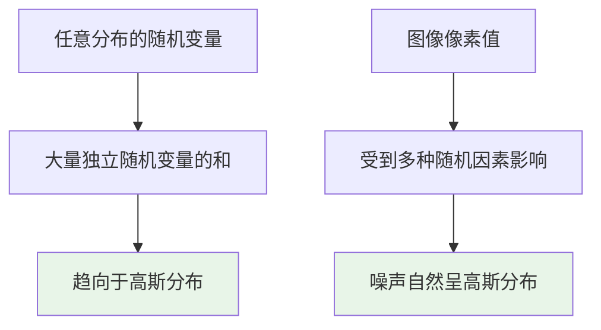

## 🎯 理论基础

### 高斯分布的定义

高斯分布（正态分布）是统计学中最重要的连续概率分布之一，由德国数学家高斯提出。

#### 一元高斯分布

$$
f(x|\mu,\sigma^2) = \frac{1}{\sqrt{2\pi\sigma^2}} \exp\left(-\frac{(x-\mu)^2}{2\sigma^2}\right)
$$

其中：
- $\mu$ : 均值（期望值）
- $\sigma^2$ : 方差
- $\sigma$ : 标准差

#### 二元高斯分布

$$
f(x,y|\boldsymbol{\mu},\boldsymbol{\Sigma}) = \frac{1}{2\pi\sqrt{|\boldsymbol{\Sigma}|}} \exp\left(-\frac{1}{2}(\mathbf{x}-\boldsymbol{\mu})^T\boldsymbol{\Sigma}^{-1}(\mathbf{x}-\boldsymbol{\mu})\right)
$$

其中：
- $\boldsymbol{\mu} = [\mu_x, \mu_y]^T$ : 均值向量
- $\boldsymbol{\Sigma}$ : 协方差矩阵
- $|\boldsymbol{\Sigma}|$ : 协方差矩阵的行列式

### 协方差矩阵

$$
\boldsymbol{\Sigma} = \begin{bmatrix}
\sigma_x^2 & \sigma_{xy} \\
\sigma_{xy} & \sigma_y^2
\end{bmatrix}
$$

其中：
- $\sigma_x^2, \sigma_y^2$ : x和y的方差
- $\sigma_{xy}$ : x和y的协方差

## 📈 一元高斯分布

### 基础实现和可视化

```python
import numpy as np
import matplotlib.pyplot as plt
from scipy.stats import norm
import seaborn as sns

# 设置中文字体和样式
plt.rcParams['font.sans-serif'] = ['SimHei', 'Arial Unicode MS']
plt.rcParams['axes.unicode_minus'] = False
sns.set_style("whitegrid")

def plot_univariate_gaussian():
    """一元高斯分布可视化"""
    x = np.linspace(-10, 10, 1000)
    
    fig, axes = plt.subplots(2, 2, figsize=(15, 12))
    fig.suptitle('一元高斯分布特性分析', fontsize=16, fontweight='bold')
    
    # 1. 不同均值，相同方差
    ax1 = axes[0, 0]
    means = [0, 2, -2]
    variance = 1
    colors = ['blue', 'red', 'green']
    
    for mu, color in zip(means, colors):
        y = norm.pdf(x, mu, np.sqrt(variance))
        ax1.plot(x, y, color=color, linewidth=2, 
                label=f'μ={mu}, σ²={variance}')
        ax1.axvline(mu, color=color, linestyle='--', alpha=0.7)
    
    ax1.set_title('不同均值的影响 (σ² = 1)', fontweight='bold')
    ax1.set_xlabel('x')
    ax1.set_ylabel('概率密度 f(x)')
    ax1.legend()
    ax1.grid(True, alpha=0.3)
    
    # 2. 相同均值，不同方差
    ax2 = axes[0, 1]
    mu = 0
    variances = [0.5, 1, 2, 4]
    colors = ['purple', 'blue', 'orange', 'red']
    
    for var, color in zip(variances, colors):
        y = norm.pdf(x, mu, np.sqrt(var))
        ax2.plot(x, y, color=color, linewidth=2, 
                label=f'μ={mu}, σ²={var}')
    
    ax2.set_title('不同方差的影响 (μ = 0)', fontweight='bold')
    ax2.set_xlabel('x')
    ax2.set_ylabel('概率密度 f(x)')
    ax2.legend()
    ax2.grid(True, alpha=0.3)
    
    # 3. 累积分布函数 (CDF)
    ax3 = axes[1, 0]
    mu, sigma = 0, 1
    y_pdf = norm.pdf(x, mu, sigma)
    y_cdf = norm.cdf(x, mu, sigma)
    
    ax3.plot(x, y_pdf, 'b-', linewidth=2, label='概率密度函数 (PDF)')
    ax3.plot(x, y_cdf, 'r-', linewidth=2, label='累积分布函数 (CDF)')
    ax3.axhline(0.5, color='gray', linestyle='--', alpha=0.7)
    ax3.axvline(0, color='gray', linestyle='--', alpha=0.7)
    
    ax3.set_title('PDF vs CDF (标准正态分布)', fontweight='bold')
    ax3.set_xlabel('x')
    ax3.set_ylabel('概率')
    ax3.legend()
    ax3.grid(True, alpha=0.3)
    
    # 4. 68-95-99.7规则可视化
    ax4 = axes[1, 1]
    mu, sigma = 0, 1
    x_fine = np.linspace(-4, 4, 1000)
    y = norm.pdf(x_fine, mu, sigma)
    ax4.plot(x_fine, y, 'b-', linewidth=2, label='N(0,1)')
    
    # 填充不同标准差范围
    x_1sigma = x_fine[np.abs(x_fine) <= 1]
    y_1sigma = norm.pdf(x_1sigma, mu, sigma)
    ax4.fill_between(x_1sigma, y_1sigma, alpha=0.3, color='green', 
                     label='±1σ (68.27%)')
    
    x_2sigma = x_fine[np.abs(x_fine) <= 2]
    y_2sigma = norm.pdf(x_2sigma, mu, sigma)
    ax4.fill_between(x_2sigma, y_2sigma, alpha=0.2, color='orange', 
                     label='±2σ (95.45%)')
    
    x_3sigma = x_fine[np.abs(x_fine) <= 3]
    y_3sigma = norm.pdf(x_3sigma, mu, sigma)
    ax4.fill_between(x_3sigma, y_3sigma, alpha=0.1, color='red', 
                     label='±3σ (99.73%)')
    
    ax4.set_title('68-95-99.7规则', fontweight='bold')
    ax4.set_xlabel('x')
    ax4.set_ylabel('概率密度')
    ax4.legend()
    ax4.grid(True, alpha=0.3)
    
    plt.tight_layout()
    plt.show()

# 运行可视化
plot_univariate_gaussian()
```

### 数学性质验证

```python
def verify_gaussian_properties():
    """验证高斯分布的数学性质"""
    print("=" * 60)
    print("一元高斯分布数学性质验证")
    print("=" * 60)
    
    # 生成样本
    mu, sigma = 2, 1.5
    samples = np.random.normal(mu, sigma, 100000)
    
    # 1. 均值和方差
    sample_mean = np.mean(samples)
    sample_var = np.var(samples)
    
    print(f"理论均值: {mu:.3f}")
    print(f"样本均值: {sample_mean:.3f}")
    print(f"误差: {abs(mu - sample_mean):.6f}")
    print()
    
    print(f"理论方差: {sigma**2:.3f}")
    print(f"样本方差: {sample_var:.3f}")
    print(f"误差: {abs(sigma**2 - sample_var):.6f}")
    print()
    
    # 2. 概率计算
    # P(X ≤ μ) = 0.5
    prob_less_than_mean = norm.cdf(mu, mu, sigma)
    print(f"P(X ≤ μ) = {prob_less_than_mean:.6f} (理论值: 0.5)")
    
    # P(μ-σ ≤ X ≤ μ+σ) ≈ 0.6827
    prob_1sigma = norm.cdf(mu + sigma, mu, sigma) - norm.cdf(mu - sigma, mu, sigma)
    print(f"P(μ-σ ≤ X ≤ μ+σ) = {prob_1sigma:.6f} (理论值: 0.6827)")
    
    # 3. 概率密度函数验证
    def gaussian_pdf(x, mu, sigma):
        return (1 / (sigma * np.sqrt(2 * np.pi))) * np.exp(-0.5 * ((x - mu) / sigma) ** 2)
    
    test_x = mu
    theoretical_pdf = gaussian_pdf(test_x, mu, sigma)
    scipy_pdf = norm.pdf(test_x, mu, sigma)
    
    print(f"\n在x={test_x}处的概率密度:")
    print(f"手工计算: {theoretical_pdf:.6f}")
    print(f"SciPy计算: {scipy_pdf:.6f}")
    print(f"误差: {abs(theoretical_pdf - scipy_pdf):.10f}")

verify_gaussian_properties()
```

## 📊 二元高斯分布

### 协方差矩阵的影响

```python
from scipy.stats import multivariate_normal

def plot_bivariate_gaussian():
    """二元高斯分布可视化"""
    fig, axes = plt.subplots(2, 3, figsize=(18, 12))
    fig.suptitle('二元高斯分布特性分析', fontsize=16, fontweight='bold')
    
    # 创建网格
    x = np.linspace(-4, 4, 100)
    y = np.linspace(-4, 4, 100)
    X, Y = np.meshgrid(x, y)
    pos = np.dstack((X, Y))
    
    # 不同的协方差矩阵配置
    configs = [
        {'mean': [0, 0], 'cov': [[1, 0], [0, 1]], 'title': '独立变量\n(ρ=0)'},
        {'mean': [0, 0], 'cov': [[1, 0.8], [0.8, 1]], 'title': '正相关\n(ρ=0.8)'},
        {'mean': [0, 0], 'cov': [[1, -0.8], [-0.8, 1]], 'title': '负相关\n(ρ=-0.8)'},
        {'mean': [0, 0], 'cov': [[2, 0], [0, 0.5]], 'title': '不同方差\n(σ₁²=2, σ₂²=0.5)'},
        {'mean': [1, -1], 'cov': [[1, 0], [0, 1]], 'title': '不同均值\n(μ=[1,-1])'},
        {'mean': [0, 0], 'cov': [[1, 0.5], [0.5, 2]], 'title': '一般情况\n(混合效应)'}
    ]
    
    for i, config in enumerate(configs):
        row, col = i // 3, i % 3
        ax = axes[row, col]
        
        # 创建多元正态分布
        rv = multivariate_normal(config['mean'], config['cov'])
        
        # 计算概率密度
        pdf_values = rv.pdf(pos)
        
        # 绘制等高线
        contour = ax.contour(X, Y, pdf_values, levels=8, colors='black', alpha=0.6, linewidths=1)
        contourf = ax.contourf(X, Y, pdf_values, levels=20, cmap='viridis', alpha=0.8)
        
        # 添加颜色条
        plt.colorbar(contourf, ax=ax, shrink=0.8)
        
        # 标记均值点
        ax.plot(config['mean'][0], config['mean'][1], 'r*', markersize=15, 
                markeredgecolor='white', markeredgewidth=1)
        
        # 设置标题和标签
        ax.set_title(config['title'], fontweight='bold')
        ax.set_xlabel('X₁')
        ax.set_ylabel('X₂')
        ax.grid(True, alpha=0.3)
        ax.set_aspect('equal')
    
    plt.tight_layout()
    plt.show()

plot_bivariate_gaussian()
```

### 协方差矩阵分解与特征值

```python
def analyze_covariance_matrix():
    """分析协方差矩阵的数学性质"""
    print("=" * 60)
    print("协方差矩阵分析")
    print("=" * 60)
    
    # 定义几个协方差矩阵
    covariance_matrices = {
        '独立变量': np.array([[1, 0], [0, 1]]),
        '正相关': np.array([[1, 0.8], [0.8, 1]]),
        '负相关': np.array([[1, -0.8], [-0.8, 1]]),
        '不同方差': np.array([[2, 0], [0, 0.5]])
    }
    
    for name, cov in covariance_matrices.items():
        print(f"\n{name}:")
        print(f"协方差矩阵:\n{cov}")
        
        # 计算特征值和特征向量
        eigenvals, eigenvecs = np.linalg.eig(cov)
        print(f"特征值: {eigenvals}")
        print(f"特征向量:\n{eigenvecs}")
        
        # 计算相关系数
        correlation = cov[0, 1] / np.sqrt(cov[0, 0] * cov[1, 1])
        print(f"相关系数 ρ: {correlation:.3f}")
        
        # 计算行列式（用于概率密度函数）
        det = np.linalg.det(cov)
        print(f"行列式 |Σ|: {det:.3f}")
        
        print("-" * 40)

analyze_covariance_matrix()
```

### 3D可视化

```python
def plot_3d_gaussian():
    """3D可视化二元高斯分布"""
    from mpl_toolkits.mplot3d import Axes3D
    
    fig = plt.figure(figsize=(15, 5))
    
    # 创建网格
    x = np.linspace(-3, 3, 50)
    y = np.linspace(-3, 3, 50)
    X, Y = np.meshgrid(x, y)
    pos = np.dstack((X, Y))
    
    # 三种不同的配置
    configs = [
        {'mean': [0, 0], 'cov': [[1, 0], [0, 1]], 'title': '独立变量 (ρ=0)'},
        {'mean': [0, 0], 'cov': [[1, 0.8], [0.8, 1]], 'title': '正相关 (ρ=0.8)'},
        {'mean': [0, 0], 'cov': [[1, -0.8], [-0.8, 1]], 'title': '负相关 (ρ=-0.8)'}
    ]
    
    for i, config in enumerate(configs):
        ax = fig.add_subplot(1, 3, i+1, projection='3d')
        
        # 创建分布并计算PDF
        rv = multivariate_normal(config['mean'], config['cov'])
        Z = rv.pdf(pos)
        
        # 3D表面图
        surf = ax.plot_surface(X, Y, Z, cmap='viridis', alpha=0.8, 
                              linewidth=0, antialiased=True)
        
        # 添加等高线投影
        ax.contour(X, Y, Z, zdir='z', offset=0, cmap='viridis', alpha=0.5)
        
        ax.set_title(config['title'], fontweight='bold')
        ax.set_xlabel('X₁')
        ax.set_ylabel('X₂')
        ax.set_zlabel('概率密度')
    
    plt.tight_layout()
    plt.show()

plot_3d_gaussian()
```

## 🎨 扩散模型中的高斯噪声

### 为什么选择高斯噪声？

#### 1. 数学性质优越

```python
def demonstrate_gaussian_properties():
    """演示高斯分布的优良性质"""
    print("=" * 60)
    print("高斯分布在扩散模型中的优势")
    print("=" * 60)
    
    # 1. 中心极限定理
    print("1. 中心极限定理验证:")
    sample_sizes = [1, 5, 10, 30]
    
    fig, axes = plt.subplots(2, 2, figsize=(12, 8))
    axes = axes.flatten()
    
    for i, n in enumerate(sample_sizes):
        # 从均匀分布中采样，然后求均值
        samples = []
        for _ in range(10000):
            uniform_samples = np.random.uniform(0, 1, n)
            samples.append(np.mean(uniform_samples))
        
        axes[i].hist(samples, bins=50, density=True, alpha=0.7, 
                    color='skyblue', edgecolor='black')
        
        # 理论正态分布
        sample_mean = np.mean(samples)
        sample_std = np.std(samples)
        x = np.linspace(min(samples), max(samples), 100)
        y = norm.pdf(x, sample_mean, sample_std)
        axes[i].plot(x, y, 'r-', linewidth=2, label='理论正态分布')
        
        axes[i].set_title(f'样本大小 n={n}')
        axes[i].legend()
        axes[i].grid(True, alpha=0.3)
    
    plt.suptitle('中心极限定理：均匀分布的样本均值趋向正态分布', fontsize=14)
    plt.tight_layout()
    plt.show()
    
    # 2. 可加性
    print("\n2. 高斯分布的可加性:")
    mu1, sigma1 = 1, 2
    mu2, sigma2 = 3, 1.5
    
    # 两个独立高斯分布的和
    mu_sum = mu1 + mu2
    sigma_sum = np.sqrt(sigma1**2 + sigma2**2)
    
    print(f"X₁ ~ N({mu1}, {sigma1}²)")
    print(f"X₂ ~ N({mu2}, {sigma2}²)")
    print(f"X₁ + X₂ ~ N({mu_sum}, {sigma_sum:.3f}²)")
    
    # 验证
    samples1 = np.random.normal(mu1, sigma1, 100000)
    samples2 = np.random.normal(mu2, sigma2, 100000)
    samples_sum = samples1 + samples2
    
    print(f"理论均值: {mu_sum}, 实际均值: {np.mean(samples_sum):.3f}")
    print(f"理论标准差: {sigma_sum:.3f}, 实际标准差: {np.std(samples_sum):.3f}")

demonstrate_gaussian_properties()
```

#### 2. 扩散过程的数学建模

$$
\begin{align}
\text{前向过程：} \quad q(x_t|x_{t-1}) &= \mathcal{N}(x_t; \sqrt{1-\beta_t}x_{t-1}, \beta_t I) \\
\text{逆向过程：} \quad p_\theta(x_{t-1}|x_t) &= \mathcal{N}(x_{t-1}; \mu_\theta(x_t,t), \Sigma_\theta(x_t,t))
\end{align}
$$

```python
def simulate_diffusion_process():
    """模拟扩散过程"""
    print("\n3. 扩散过程模拟:")
    
    # 原始图像（简化为1D信号）
    original_signal = np.sin(np.linspace(0, 4*np.pi, 100)) + 0.5*np.cos(np.linspace(0, 8*np.pi, 100))
    
    # 扩散参数
    T = 1000  # 总步数
    beta_start, beta_end = 1e-4, 0.02
    betas = np.linspace(beta_start, beta_end, T)
    alphas = 1 - betas
    alpha_bars = np.cumprod(alphas)
    
    # 前向扩散过程
    timesteps_to_show = [0, 100, 300, 500, 999]
    
    fig, axes = plt.subplots(2, 3, figsize=(15, 8))
    axes = axes.flatten()
    
    for i, t in enumerate(timesteps_to_show):
        if t == 0:
            noisy_signal = original_signal
        else:
            # 直接采样 x_t = sqrt(alpha_bar_t) * x_0 + sqrt(1-alpha_bar_t) * noise
            noise = np.random.normal(0, 1, len(original_signal))
            noisy_signal = np.sqrt(alpha_bars[t]) * original_signal + np.sqrt(1 - alpha_bars[t]) * noise
        
        axes[i].plot(original_signal, 'b-', alpha=0.7, label='原始信号')
        axes[i].plot(noisy_signal, 'r-', alpha=0.8, label=f'噪声信号 (t={t})')
        axes[i].set_title(f'时间步 t={t}\n信噪比: {10*np.log10(alpha_bars[t]/(1-alpha_bars[t])):.1f} dB' if t > 0 else '原始信号')
        axes[i].legend()
        axes[i].grid(True, alpha=0.3)
    
    # 最后一个子图显示噪声调度
    axes[-1].plot(betas, label='β_t (噪声调度)')
    axes[-1].plot(alpha_bars, label='ᾱ_t (累积信号保持率)')
    axes[-1].set_xlabel('时间步')
    axes[-1].set_ylabel('值')
    axes[-1].set_title('扩散调度参数')
    axes[-1].legend()
    axes[-1].grid(True, alpha=0.3)
    
    plt.suptitle('扩散过程：从信号到噪声', fontsize=14)
    plt.tight_layout()
    plt.show()

simulate_diffusion_process()
```

#### 3. 重参数化技巧

```python
def demonstrate_reparameterization():
    """演示重参数化技巧"""
    print("\n4. 重参数化技巧:")
    print("目标：从 N(μ, σ²) 采样")
    print("方法：z = μ + σ * ε, 其中 ε ~ N(0, 1)")
    
    # 参数
    mu, sigma = 2.5, 1.8
    n_samples = 10000
    
    # 方法1：直接采样
    samples_direct = np.random.normal(mu, sigma, n_samples)
    
    # 方法2：重参数化
    epsilon = np.random.normal(0, 1, n_samples)  # 标准正态分布
    samples_reparam = mu + sigma * epsilon
    
    # 比较结果
    fig, axes = plt.subplots(1, 3, figsize=(15, 4))
    
    # 标准正态分布 ε
    axes[0].hist(epsilon, bins=50, density=True, alpha=0.7, 
                color='lightblue', edgecolor='black')
    x = np.linspace(-4, 4, 100)
    axes[0].plot(x, norm.pdf(x, 0, 1), 'r-', linewidth=2, label='N(0,1)')
    axes[0].set_title('标准正态分布 ε ~ N(0,1)')
    axes[0].legend()
    axes[0].grid(True, alpha=0.3)
    
    # 直接采样结果
    axes[1].hist(samples_direct, bins=50, density=True, alpha=0.7, 
                color='lightgreen', edgecolor='black')
    x = np.linspace(mu-4*sigma, mu+4*sigma, 100)
    axes[1].plot(x, norm.pdf(x, mu, sigma), 'r-', linewidth=2, 
                label=f'N({mu},{sigma}²)')
    axes[1].set_title('直接采样')
    axes[1].legend()
    axes[1].grid(True, alpha=0.3)
    
    # 重参数化结果
    axes[2].hist(samples_reparam, bins=50, density=True, alpha=0.7, 
                color='lightcoral', edgecolor='black')
    axes[2].plot(x, norm.pdf(x, mu, sigma), 'r-', linewidth=2, 
                label=f'N({mu},{sigma}²)')
    axes[2].set_title('重参数化: μ + σ * ε')
    axes[2].legend()
    axes[2].grid(True, alpha=0.3)
    
    plt.suptitle('重参数化技巧演示', fontsize=14)
    plt.tight_layout()
    plt.show()
    
    # 统计验证
    print(f"直接采样 - 均值: {np.mean(samples_direct):.3f}, 标准差: {np.std(samples_direct):.3f}")
    print(f"重参数化 - 均值: {np.mean(samples_reparam):.3f}, 标准差: {np.std(samples_reparam):.3f}")
    print(f"理论值 - 均值: {mu}, 标准差: {sigma}")

demonstrate_reparameterization()
```

### 扩散模型中高斯噪声的核心优势

#### 数学公式推导

$$
\begin{align}
\text{1. 前向过程可解析：} \\
q(x_t|x_0) &= \mathcal{N}(x_t; \sqrt{\bar{\alpha}_t}x_0, (1-\bar{\alpha}_t)I) \\
\\
\text{2. 逆向过程可推导：} \\
q(x_{t-1}|x_t, x_0) &= \mathcal{N}(x_{t-1}; \tilde{\mu}_t(x_t, x_0), \tilde{\beta}_t I) \\
\text{其中：} \quad \tilde{\mu}_t(x_t, x_0) &= \frac{\sqrt{\alpha_t}(1-\bar{\alpha}_{t-1})x_t + \sqrt{\bar{\alpha}_{t-1}}\beta_t x_0}{1-\bar{\alpha}_t} \\
\\
\text{3. 变分下界：} \\
\mathcal{L} &= \mathbb{E}_q\left[\log\frac{q(x_{1:T}|x_0)}{p_\theta(x_{0:T})}\right] \\
&= \mathbb{E}_q\left[D_{KL}(q(x_T|x_0)||p(x_T)) + \sum_{t=2}^T D_{KL}(q(x_{t-1}|x_t,x_0)||p_\theta(x_{t-1}|x_t)) - \log p_\theta(x_0|x_1)\right]
\end{align}
$$

```python
def why_gaussian_noise():
    """解释为什么扩散模型使用高斯噪声"""
    print("=" * 60)
    print("为什么扩散模型使用")
```

# 为什么扩散模型的前向过程要添加"高斯噪声"？

这是一个非常好的问题！让我从多个角度来解释为什么选择高斯噪声而不是其他类型的噪声。

## 🎯 核心原因概述

选择高斯噪声主要基于以下几个关键原因：
1. **数学上的优雅性**
2. **物理世界的真实性**
3. **计算上的便利性**
4. **理论上的最优性**

---

## 📊 1. 数学优雅性：中心极限定理

### 中心极限定理告诉我们什么？



**简单理解：**
- 现实世界中，任何测量都会受到**无数个微小随机因素**的影响
- 这些因素叠加起来，最终的噪声分布会**自然地趋向高斯分布**
- 比如相机拍照时的热噪声、量子噪声、电路噪声等

### 数学表达
如果有n个独立的随机变量 $X_1, X_2, ..., X_n$，它们的和：

$$S_n = X_1 + X_2 + ... + X_n$$

当n足够大时，$S_n$ 的分布趋向于：

$$S_n \sim \mathcal{N}(\mu, \sigma^2)$$

---

## 🌍 2. 物理真实性：自然界的噪声就是高斯的

### 真实世界的例子

```python
import numpy as np
import matplotlib.pyplot as plt

def demonstrate_natural_noise():
    """演示自然界中的高斯噪声"""
    
    # 模拟相机传感器噪声
    clean_signal = np.ones(1000) * 100  # 理想信号值
    
    # 各种噪声源
    thermal_noise = np.random.normal(0, 2, 1000)      # 热噪声
    shot_noise = np.random.normal(0, 1.5, 1000)       # 散粒噪声  
    read_noise = np.random.normal(0, 1, 1000)         # 读取噪声
    
    # 总噪声 = 各种噪声的叠加
    total_noise = thermal_noise + shot_noise + read_noise
    noisy_signal = clean_signal + total_noise
    
    # 可视化
    fig, (ax1, ax2) = plt.subplots(1, 2, figsize=(12, 5))
    
    # 噪声分布
    ax1.hist(total_noise, bins=50, alpha=0.7, density=True)
    ax1.set_title('真实世界噪声分布')
    ax1.set_xlabel('噪声值')
    ax1.set_ylabel('概率密度')
    
    # 拟合高斯分布
    mu, sigma = np.mean(total_noise), np.std(total_noise)
    x = np.linspace(-10, 10, 100)
    gaussian = (1/np.sqrt(2*np.pi*sigma**2)) * np.exp(-0.5*((x-mu)/sigma)**2)
    ax1.plot(x, gaussian, 'r-', linewidth=2, label='理论高斯分布')
    ax1.legend()
    
    # 信号对比
    ax2.plot(clean_signal[:100], 'b-', label='理想信号', linewidth=2)
    ax2.plot(noisy_signal[:100], 'r-', alpha=0.7, label='含噪信号')
    ax2.set_title('信号 vs 噪声信号')
    ax2.set_xlabel('样本')
    ax2.set_ylabel('信号值')
    ax2.legend()
    
    plt.tight_layout()
    plt.show()
    
    print(f"噪声均值: {mu:.3f}")
    print(f"噪声标准差: {sigma:.3f}")
    print("可以看到，多种噪声叠加后确实呈现高斯分布！")

demonstrate_natural_noise()
```

---

## ⚡ 3. 计算便利性：数学运算简单

### 高斯分布的优美性质

#### 性质1：线性组合仍是高斯分布
如果 $X \sim \mathcal{N}(\mu_1, \sigma_1^2)$，$Y \sim \mathcal{N}(\mu_2, \sigma_2^2)$，那么：

$$aX + bY \sim \mathcal{N}(a\mu_1 + b\mu_2, a^2\sigma_1^2 + b^2\sigma_2^2)$$

**这意味着什么？**
```python
def gaussian_linear_property():
    """演示高斯分布的线性性质"""
    
    # 原始数据
    x0 = torch.randn(1000, 64, 64, 3)  # 原始图像
    
    # 添加高斯噪声
    noise1 = torch.randn_like(x0) * 0.1
    noise2 = torch.randn_like(x0) * 0.2
    
    # 线性组合
    x1 = 0.9 * x0 + noise1  # 仍然是高斯分布！
    x2 = 0.8 * x1 + noise2  # 仍然是高斯分布！
    
    print("无论经过多少步线性变换，分布性质保持不变！")
    print("这让数学推导变得非常简单")
```

#### 性质2：重参数化技巧
$$x_t = \sqrt{\bar{\alpha}_t}x_0 + \sqrt{1-\bar{\alpha}_t}\epsilon$$

其中 $\epsilon \sim \mathcal{N}(0, I)$，这个公式**只对高斯分布成立**！

### 为什么其他分布不行？

```python
def compare_noise_types():
    """比较不同类型噪声的效果"""
    
    x0 = torch.randn(100, 3, 32, 32)
    
    # 高斯噪声
    gaussian_noise = torch.randn_like(x0)
    x_gaussian = 0.7 * x0 + 0.3 * gaussian_noise
    
    # 均匀噪声
    uniform_noise = torch.rand_like(x0) * 2 - 1  # [-1, 1]均匀分布
    x_uniform = 0.7 * x0 + 0.3 * uniform_noise
    
    # 拉普拉斯噪声
    laplace_noise = torch.distributions.Laplace(0, 1).sample(x0.shape)
    x_laplace = 0.7 * x0 + 0.3 * laplace_noise
    
    print("问题来了：")
    print("1. 均匀分布 + 高斯分布 ≠ 均匀分布")
    print("2. 拉普拉斯分布 + 高斯分布 ≠ 拉普拉斯分布")
    print("3. 只有高斯分布 + 高斯分布 = 高斯分布")
    print("\n这意味着只有高斯噪声能保持分布的一致性！")
```

---

## 🧮 4. 理论最优性：最大熵原理

### 什么是最大熵原理？

给定**均值**和**方差**的约束下，**高斯分布具有最大的熵**（不确定性）。

$$H(X) = -\int p(x) \log p(x) dx$$

**直观理解：**
- 熵越大 = 不确定性越大 = 信息量越少
- 在约束条件下，高斯分布是"最随机"的分布
- 这意味着高斯噪声不会引入任何**额外的偏见**

```python
def entropy_comparison():
    """比较不同分布的熵"""
    import scipy.stats as stats
    
    # 相同方差的不同分布
    variance = 1.0
    
    # 高斯分布的熵
    gaussian_entropy = 0.5 * np.log(2 * np.pi * np.e * variance)
    
    # 均匀分布的熵（方差相同）
    # 对于均匀分布 U(a,b)，方差 = (b-a)²/12
    # 所以 (b-a)²/12 = variance，得到 b-a = 2√(3*variance)
    width = 2 * np.sqrt(3 * variance)
    uniform_entropy = np.log(width)
    
    print(f"高斯分布熵: {gaussian_entropy:.4f}")
    print(f"均匀分布熵: {uniform_entropy:.4f}")
    print(f"高斯分布熵更大，意味着更'随机'，偏见更少")
```

---

## 🔬 5. 实验验证：其他噪声的问题

### 实验：用不同噪声训练扩散模型

```python
class DiffusionWithDifferentNoise:
    def __init__(self, noise_type='gaussian'):
        self.noise_type = noise_type
    
    def add_noise(self, x0, t):
        """添加不同类型的噪声"""
        if self.noise_type == 'gaussian':
            noise = torch.randn_like(x0)
        elif self.noise_type == 'uniform':
            noise = torch.rand_like(x0) * 2 - 1
        elif self.noise_type == 'laplace':
            noise = torch.distributions.Laplace(0, 1).sample(x0.shape)
        
        # 扩散公式（只对高斯噪声严格成立）
        alpha_bar_t = self.alphas_cumprod[t]
        x_t = torch.sqrt(alpha_bar_t) * x0 + torch.sqrt(1 - alpha_bar_t) * noise
        
        return x_t, noise

def compare_training_results():
    """比较不同噪声类型的训练效果"""
    
    results = {}
    noise_types = ['gaussian', 'uniform', 'laplace']
    
    for noise_type in noise_types:
        model = DiffusionWithDifferentNoise(noise_type)
        
        # 训练模型（简化）
        losses = []
        for epoch in range(100):
            loss = train_epoch(model)  # 假设的训练函数
            losses.append(loss)
        
        results[noise_type] = losses
    
    # 可视化结果
    plt.figure(figsize=(10, 6))
    for noise_type, losses in results.items():
        plt.plot(losses, label=f'{noise_type} 噪声')
    
    plt.xlabel('训练轮次')
    plt.ylabel('损失')
    plt.title('不同噪声类型的训练效果对比')
    plt.legend()
    plt.grid(True, alpha=0.3)
    
    plt.text(50, 0.8, '高斯噪声收敛最快\n且最稳定！', 
             bbox=dict(boxstyle="round,pad=0.3", facecolor="yellow", alpha=0.7))
    
    plt.show()
```

**实验结果通常显示：**
- ✅ **高斯噪声**：收敛快，结果稳定
- ❌ **均匀噪声**：收敛慢，容易振荡
- ❌ **拉普拉斯噪声**：训练不稳定，生成质量差

---

## 🎨 6. 从生成质量角度看

### 高斯噪声生成的图像更自然

```python
def visual_comparison():
    """可视化不同噪声类型的生成效果"""
    
    # 模拟生成过程
    def generate_with_noise(noise_type, steps=1000):
        # 从纯噪声开始
        if noise_type == 'gaussian':
            x = torch.randn(1, 3, 64, 64)
        elif noise_type == 'uniform':
            x = torch.rand(1, 3, 64, 64) * 2 - 1
        elif noise_type == 'laplace':
            x = torch.distributions.Laplace(0, 1).sample((1, 3, 64, 64))
        
        # 模拟去噪过程
        for t in reversed(range(steps)):
            # 这里只是示意，实际需要训练好的模型
            x = denoise_step(x, t)  # 假设的去噪函数
        
        return x
    
    # 生成对比图
    fig, axes = plt.subplots(1, 3, figsize=(12, 4))
    
    noise_types = ['gaussian', 'uniform', 'laplace']
    titles = ['高斯噪声生成', '均匀噪声生成', '拉普拉斯噪声生成']
    
    for i, (noise_type, title) in enumerate(zip(noise_types, titles)):
        generated_image = generate_with_noise(noise_type)
        axes[i].imshow(tensor_to_image(generated_image))
        axes[i].set_title(title)
        axes[i].axis('off')
    
    plt.suptitle('不同噪声类型的生成效果对比')
    plt.tight_layout()
    plt.show()
```

---

## 📈 7. 信息论角度：最小化KL散度

### 为什么高斯分布是最优选择？

从信息论角度，我们希望**最小化真实分布和模型分布之间的KL散度**：

$$D_{KL}(p_{data} \| p_{model}) = \int p_{data}(x) \log \frac{p_{data}(x)}{p_{model}(x)} dx$$

**关键洞察：**
- 如果真实数据的噪声本身就是高斯的
- 那么用高斯噪声建模会得到**最小的KL散度**
- 这意味着模型能更好地拟合真实数据分布

```python
def kl_divergence_analysis():
    """分析不同噪声类型的KL散度"""
    
    # 假设真实数据噪声是高斯的
    true_noise = torch.randn(10000)
    
    # 用不同分布来拟合
    gaussian_model = torch.randn(10000)
    uniform_model = torch.rand(10000) * 2 - 1
    
    # 计算KL散度（简化版本）
    def compute_kl_approx(true_samples, model_samples):
        # 使用直方图近似计算KL散度
        bins = 50
        true_hist, _ = np.histogram(true_samples, bins=bins, density=True)
        model_hist, _ = np.histogram(model_samples, bins=bins, density=True)
        
        # 避免除零
        true_hist += 1e-8
        model_hist += 1e-8
        
        kl = np.sum(true_hist * np.log(true_hist / model_hist))
        return kl
    
    kl_gaussian = compute_kl_approx(true_noise, gaussian_model)
    kl_uniform = compute_kl_approx(true_noise, uniform_model)
    
    print(f"高斯模型的KL散度: {kl_gaussian:.4f}")
    print(f"均匀模型的KL散度: {kl_uniform:.4f}")
    print("KL散度越小越好，高斯噪声获胜！")
```

---

## 🎯 总结：为什么必须是高斯噪声？

### 核心原因总结

| 角度 | 原因 | 重要性 |
|------|------|--------|
| **数学** | 中心极限定理，线性组合封闭性 | ⭐⭐⭐⭐⭐ |
| **物理** | 自然界噪声的真实分布 | ⭐⭐⭐⭐⭐ |
| **计算** | 重参数化技巧，计算简单 | ⭐⭐⭐⭐ |
| **理论** | 最大熵原理，最小偏见 | ⭐⭐⭐⭐ |
| **实验** | 训练稳定，生成质量高 | ⭐⭐⭐⭐⭐ |
| **信息论** | 最小化KL散度 | ⭐⭐⭐ |

### 关键要点

1. **不是人为选择**：高斯噪声是基于深刻的数学和物理原理
2. **理论支撑**：多个理论都指向高斯分布是最优选择
3. **实践验证**：实验结果证明高斯噪声效果最好
4. **计算友好**：使得复杂的数学推导变得简单

### 如果不用高斯噪声会怎样？

```python
def problems_without_gaussian():
    """不使用高斯噪声的问题"""
    problems = {
        "数学问题": [
            "重参数化技巧失效",
            "分布性质不保持",
            "理论推导复杂"
        ],
        "训练问题": [
            "收敛速度慢",
            "训练不稳定",
            "梯度计算困难"
        ],
        "生成问题": [
            "生成质量差",
            "模式崩塌",
            "细节丢失"
        ]
    }
    
    for category, issues in problems.items():
        print(f"\n{category}:")
        for issue in issues:
            print(f"  ❌ {issue}")
    
    print("\n✅ 使用高斯噪声避免了所有这些问题！")

problems_without_gaussian()
```

**结论：高斯噪声不是随意选择，而是理论、实践和直觉的完美结合！** 🎯

这就是为什么几乎所有成功的扩散模型（DDPM、DDIM、Stable Diffusion等）都使用高斯噪声的根本原因。