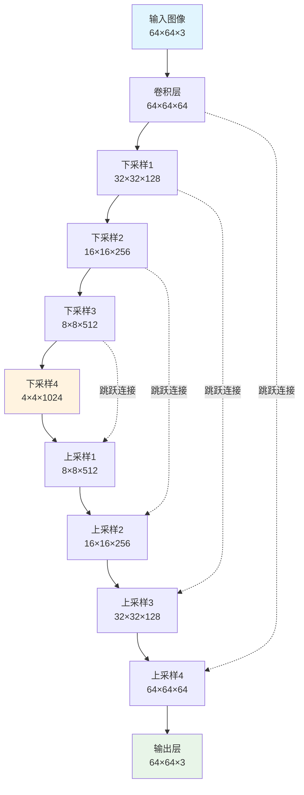
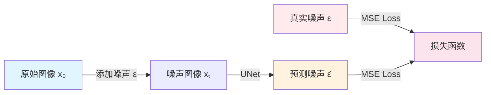
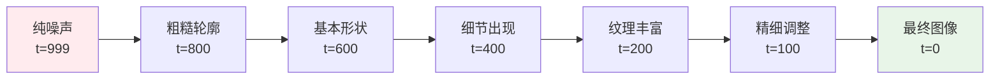

# 扩散模型完整教程：从理论到实践

## 目录
1. [扩散模型基础理论](#1-扩散模型基础理论)
2. [数学原理详解](#2-数学原理详解)
3. [网络架构设计](#3-网络架构设计)
4. [代码实现详解](#4-代码实现详解)
5. [训练过程分析](#5-训练过程分析)
6. [生成过程演示](#6-生成过程演示)
7. [实验结果与调优](#7-实验结果与调优)

---

## 1. 扩散模型基础理论

### 1.1 什么是扩散模型？

扩散模型是一类生成模型，通过模拟物理世界中的扩散过程来生成数据。其核心思想是：


### 1.2 扩散过程的两个阶段

**前向过程（Forward Process）**：
- 从真实数据开始，逐步添加高斯噪声
- 经过T步后，数据变成纯噪声
- 这个过程是固定的，不需要学习

**反向过程（Reverse Process）**：
- 从纯噪声开始，逐步去除噪声
- 经过T步后，恢复成清晰图像
- 这个过程需要神经网络学习

### 1.3 直观理解

想象一滴墨水滴入清水中：
- **前向过程**：墨水逐渐扩散，最终变成均匀的灰水
- **反向过程**：如果我们能"倒放"这个过程，就能从灰水中恢复出原始的墨水滴

---

## 2. 数学原理详解

### 2.1 前向扩散过程

给定原始数据 $x_0$，前向过程定义为：

$$q(x_t|x_{t-1}) = \mathcal{N}(x_t; \sqrt{1-\beta_t}x_{t-1}, \beta_t I)$$

其中：
- $\beta_t$ 是时间步 $t$ 的噪声调度参数
- $\mathcal{N}$ 表示高斯分布

#### 重参数化技巧

通过重参数化，我们可以直接从 $x_0$ 采样到任意时间步 $x_t$：

$$x_t = \sqrt{\bar{\alpha}_t}x_0 + \sqrt{1-\bar{\alpha}_t}\epsilon$$

其中：
- $\alpha_t = 1 - \beta_t$
- $\bar{\alpha}_t = \prod_{s=1}^t \alpha_s$
- $\epsilon \sim \mathcal{N}(0, I)$

```python
def forward_diffusion_sample(x_0, t, sqrt_alphas_cumprod, sqrt_one_minus_alphas_cumprod):
    """
    实现上述公式的代码
    """
    noise = torch.randn_like(x_0)  # ε ~ N(0,I)
    
    sqrt_alpha_cumprod_t = sqrt_alphas_cumprod[t].view(-1, 1, 1, 1)  # √(ᾱₜ)
    sqrt_one_minus_alpha_cumprod_t = sqrt_one_minus_alphas_cumprod[t].view(-1, 1, 1, 1)  # √(1-ᾱₜ)
    
    # xₜ = √(ᾱₜ)x₀ + √(1-ᾱₜ)ε
    x_t = sqrt_alpha_cumprod_t * x_0 + sqrt_one_minus_alpha_cumprod_t * noise
    return x_t, noise
```

### 2.2 反向去噪过程

反向过程的目标是学习：

$$p_\theta(x_{t-1}|x_t) = \mathcal{N}(x_{t-1}; \mu_\theta(x_t, t), \Sigma_\theta(x_t, t))$$

#### DDPM的关键洞察

通过贝叶斯公式，可以证明最优的均值为：

$$\mu_\theta(x_t, t) = \frac{1}{\sqrt{\alpha_t}}\left(x_t - \frac{1-\alpha_t}{\sqrt{1-\bar{\alpha}_t}}\epsilon_\theta(x_t, t)\right)$$

这意味着我们只需要训练一个噪声预测网络 $\epsilon_\theta(x_t, t)$！

### 2.3 训练目标

简化后的损失函数为：

$$L = \mathbb{E}_{t,x_0,\epsilon}\left[\|\epsilon - \epsilon_\theta(x_t, t)\|^2\right]$$

这就是一个简单的**噪声预测任务**！

---

## 3. 网络架构设计

### 3.1 为什么选择UNet？

UNet具有以下优势：
1. **跳跃连接**：保留细节信息
2. **多尺度特征**：处理不同大小的结构
3. **对称结构**：编码器-解码器设计



### 3.2 时间嵌入

时间信息通过正弦位置编码注入网络：

$$\text{PE}(t, 2i) = \sin\left(\frac{t}{10000^{2i/d}}\right)$$
$$\text{PE}(t, 2i+1) = \cos\left(\frac{t}{10000^{2i/d}}\right)$$

```python
class TimePositionalEncoding(nn.Module):
    def forward(self, timesteps):
        device = timesteps.device
        half_dim = self.dim // 2
        
        # 计算频率
        scale = math.log(10000) / (half_dim - 1)
        exponents = torch.exp(torch.arange(half_dim, device=device) * -scale)
        
        # 计算正弦和余弦
        args = timesteps[:, None] * exponents[None, :]
        emb = torch.cat([args.sin(), args.cos()], dim=-1)
        
        return emb
```

### 3.3 UNet阶段设计

每个UNet阶段包含：
1. **卷积层**：特征提取
2. **时间嵌入注入**：告诉网络当前时间步
3. **批归一化 + 激活**：稳定训练
4. **空间变换**：上采样或下采样

```python
class UNetStage(nn.Module):
    def forward(self, x, timesteps, labels=None):
        # 第一个卷积
        out = self.bn1(self.act(self.conv_in(x)))
        
        # 注入时间信息
        t_emb = self.act(self.time_proj(self.time_encoder(timesteps)))
        out = out + t_emb[..., None, None]  # 广播到空间维度
        
        # 第二个卷积和空间变换
        out = self.bn2(self.act(self.conv_feat(out)))
        return self.spatial(out)  # 上采样或下采样
```

---

## 4. 代码实现详解

### 4.1 扩散调度表初始化

```python
def initialize_diffusion_schedule(T=1000):
    """初始化扩散过程的所有参数"""
    # 线性beta调度
    betas = torch.linspace(1e-4, 0.02, T)
    
    # 计算alpha相关参数
    alphas = 1. - betas
    alphas_cumprod = torch.cumprod(alphas, dim=0)
    
    # 预计算常用项
    sqrt_alphas_cumprod = torch.sqrt(alphas_cumprod)
    sqrt_one_minus_alphas_cumprod = torch.sqrt(1 - alphas_cumprod)
    
    return {
        'betas': betas,
        'alphas': alphas,
        'alphas_cumprod': alphas_cumprod,
        'sqrt_alphas_cumprod': sqrt_alphas_cumprod,
        'sqrt_one_minus_alphas_cumprod': sqrt_one_minus_alphas_cumprod
    }
```

### 4.2 前向扩散可视化

让我们看看前向扩散过程的效果：

```python
def visualize_forward_process():
    """可视化前向扩散过程"""
    # 加载原始图像
    image = load_image("example.jpg")
    
    # 不同时间步的结果
    timesteps = [0, 100, 300, 500, 700, 999]
    
    fig, axes = plt.subplots(1, len(timesteps), figsize=(15, 3))
    
    for i, t in enumerate(timesteps):
        if t == 0:
            noisy_image = image
        else:
            t_tensor = torch.tensor([t])
            noisy_image, _ = forward_diffusion_sample(
                image, t_tensor, sqrt_alphas_cumprod, sqrt_one_minus_alphas_cumprod
            )
        
        axes[i].imshow(tensor_to_image(noisy_image))
        axes[i].set_title(f't = {t}')
        axes[i].axis('off')
    
    plt.suptitle('前向扩散过程：从清晰图像到纯噪声')
    plt.show()
```

### 4.3 训练循环详解

```python
def train_diffusion_model():
    """训练扩散模型的完整流程"""
    
    for epoch in range(num_epochs):
        total_loss = 0
        
        for batch_idx, images in enumerate(dataloader):
            # 1. 随机采样时间步
            t = torch.randint(0, T, (batch_size,), device=device)
            
            # 2. 前向扩散：添加噪声
            noisy_images, noise = forward_diffusion_sample(
                images, t, sqrt_alphas_cumprod, sqrt_one_minus_alphas_cumprod
            )
            
            # 3. 模型预测噪声
            predicted_noise = model(noisy_images, t)
            
            # 4. 计算损失（MSE）
            loss = F.mse_loss(noise, predicted_noise)
            
            # 5. 反向传播
            optimizer.zero_grad()
            loss.backward()
            optimizer.step()
            
            total_loss += loss.item()
        
        # 打印训练进度
        avg_loss = total_loss / len(dataloader)
        print(f'Epoch {epoch}, Loss: {avg_loss:.6f}')
```

---

## 5. 训练过程分析

### 5.1 损失函数的含义

我们的目标是让模型学会预测噪声：



### 5.2 训练过程可视化

```python
def plot_training_progress(losses, noise_predictions):
    """可视化训练过程"""
    fig, (ax1, ax2) = plt.subplots(1, 2, figsize=(12, 5))
    
    # 损失曲线
    ax1.plot(losses)
    ax1.set_title('训练损失曲线')
    ax1.set_xlabel('训练步数')
    ax1.set_ylabel('MSE损失')
    ax1.grid(True, alpha=0.3)
    
    # 噪声预测质量
    for epoch, (true_noise, pred_noise) in noise_predictions.items():
        correlation = np.corrcoef(
            true_noise.flatten(), 
            pred_noise.flatten()
        )[0, 1]
        ax2.scatter(epoch, correlation, alpha=0.7)
    
    ax2.set_title('噪声预测准确度')
    ax2.set_xlabel('训练轮次')
    ax2.set_ylabel('相关系数')
    ax2.grid(True, alpha=0.3)
    
    plt.tight_layout()
    plt.show()
```

### 5.3 不同时间步的学习难度

```python
def analyze_timestep_difficulty():
    """分析不同时间步的学习难度"""
    timesteps = range(0, 1000, 50)
    difficulties = []
    
    for t in timesteps:
        # 计算该时间步的信噪比
        alpha_bar_t = alphas_cumprod[t]
        snr = alpha_bar_t / (1 - alpha_bar_t)
        difficulties.append(snr.item())
    
    plt.figure(figsize=(10, 6))
    plt.plot(timesteps, difficulties)
    plt.xlabel('时间步 t')
    plt.ylabel('信噪比 (SNR)')
    plt.title('不同时间步的学习难度')
    plt.grid(True, alpha=0.3)
    
    # 添加难度区间标注
    plt.axhspan(0, 0.1, alpha=0.2, color='red', label='极难 (纯噪声)')
    plt.axhspan(0.1, 1, alpha=0.2, color='orange', label='困难')
    plt.axhspan(1, 10, alpha=0.2, color='yellow', label='中等')
    plt.axhspan(10, float('inf'), alpha=0.2, color='green', label='简单')
    
    plt.legend()
    plt.show()
```

---

## 6. 生成过程演示

### 6.1 反向采样公式

反向采样使用以下公式：

$$x_{t-1} = \frac{1}{\sqrt{\alpha_t}}\left(x_t - \frac{1-\alpha_t}{\sqrt{1-\bar{\alpha}_t}}\epsilon_\theta(x_t, t)\right) + \sigma_t z$$

其中 $z \sim \mathcal{N}(0, I)$ 是随机噪声，$\sigma_t = \sqrt{\beta_t}$。

```python
@torch.no_grad()
def denoising_step(x_t, t, model, alphas, alphas_cumprod, betas):
    """单步去噪"""
    # 预测噪声
    predicted_noise = model(x_t, t)
    
    # 获取参数
    alpha_t = alphas[t].view(-1, 1, 1, 1)
    beta_t = betas[t].view(-1, 1, 1, 1)
    alpha_bar_t = alphas_cumprod[t].view(-1, 1, 1, 1)
    
    # 计算均值
    mean = (1.0 / torch.sqrt(alpha_t)) * (
        x_t - ((1.0 - alpha_t) / torch.sqrt(1.0 - alpha_bar_t)) * predicted_noise
    )
    
    # 添加噪声（除了最后一步）
    if t[0] > 0:
        sigma_t = torch.sqrt(beta_t)
        z = torch.randn_like(x_t)
        return mean + sigma_t * z
    else:
        return mean
```

### 6.2 完整生成过程

```python
def generate_image(model, device, image_shape=(3, 64, 64)):
    """完整的图像生成过程"""
    model.eval()
    
    # 从纯噪声开始
    x = torch.randn((1,) + image_shape, device=device)
    
    # 存储中间结果
    intermediate_images = []
    save_steps = [999, 800, 600, 400, 200, 100, 50, 0]
    
    # 逐步去噪
    for i in tqdm(reversed(range(1000)), desc="生成中"):
        t = torch.full((1,), i, dtype=torch.long, device=device)
        x = denoising_step(x, t, model, alphas, alphas_cumprod, betas)
        
        # 保存关键步骤
        if i in save_steps:
            img_pil = tensor_to_pil(x[0])
            intermediate_images.append((1000-i, img_pil))
    
    return x, intermediate_images
```

### 6.3 生成过程可视化



---

## 7. 实验结果与调优

### 7.1 超参数对结果的影响

#### 学习率调优
```python
def compare_learning_rates():
    """比较不同学习率的效果"""
    learning_rates = [1e-4, 5e-4, 1e-3, 5e-3]
    results = {}
    
    for lr in learning_rates:
        model = DiffusionUNet()
        optimizer = torch.optim.Adam(model.parameters(), lr=lr)
        
        # 训练并记录损失
        losses = train_model(model, optimizer, epochs=100)
        results[lr] = losses
    
    # 绘制比较图
    plt.figure(figsize=(10, 6))
    for lr, losses in results.items():
        plt.plot(losses, label=f'LR={lr}')
    
    plt.xlabel('训练步数')
    plt.ylabel('损失')
    plt.title('不同学习率的训练效果')
    plt.legend()
    plt.grid(True, alpha=0.3)
    plt.show()
```

#### 批大小的影响
```python
def analyze_batch_size_effect():
    """分析批大小对训练的影响"""
    batch_sizes = [16, 32, 64, 128, 256]
    
    results = {
        'batch_size': [],
        'final_loss': [],
        'training_time': [],
        'memory_usage': []
    }
    
    for bs in batch_sizes:
        # 训练模型并记录指标
        loss, time, memory = train_with_batch_size(bs)
        
        results['batch_size'].append(bs)
        results['final_loss'].append(loss)
        results['training_time'].append(time)
        results['memory_usage'].append(memory)
    
    # 可视化结果
    fig, axes = plt.subplots(1, 3, figsize=(15, 5))
    
    axes[0].plot(results['batch_size'], results['final_loss'], 'o-')
    axes[0].set_xlabel('批大小')
    axes[0].set_ylabel('最终损失')
    axes[0].set_title('批大小 vs 训练效果')
    
    axes[1].plot(results['batch_size'], results['training_time'], 'o-')
    axes[1].set_xlabel('批大小')
    axes[1].set_ylabel('训练时间 (秒)')
    axes[1].set_title('批大小 vs 训练速度')
    
    axes[2].plot(results['batch_size'], results['memory_usage'], 'o-')
    axes[2].set_xlabel('批大小')
    axes[2].set_ylabel('显存使用 (GB)')
    axes[2].set_title('批大小 vs 显存消耗')
    
    plt.tight_layout()
    plt.show()
```

### 7.2 生成质量评估

#### FID分数计算
```python
def calculate_fid_score(real_images, generated_images):
    """计算FID分数评估生成质量"""
    from torchvision.models import inception_v3
    
    # 加载预训练的Inception网络
    inception = inception_v3(pretrained=True, transform_input=False)
    inception.eval()
    
    def get_features(images):
        with torch.no_grad():
            features = inception(images)
        return features.cpu().numpy()
    
    # 提取特征
    real_features = get_features(real_images)
    gen_features = get_features(generated_images)
    
    # 计算均值和协方差
    mu_real = np.mean(real_features, axis=0)
    sigma_real = np.cov(real_features, rowvar=False)
    
    mu_gen = np.mean(gen_features, axis=0)
    sigma_gen = np.cov(gen_features, rowvar=False)
    
    # 计算FID
    diff = mu_real - mu_gen
    covmean = scipy.linalg.sqrtm(sigma_real.dot(sigma_gen))
    
    if np.iscomplexobj(covmean):
        covmean = covmean.real
    
    fid = diff.dot(diff) + np.trace(sigma_real + sigma_gen - 2 * covmean)
    return fid
```

### 7.3 常见问题与解决方案

#### 问题1：生成图像模糊
**原因**：
- 学习率过高，导致训练不稳定
- 网络容量不足
- 训练时间不够

**解决方案**：
```python
# 降低学习率
optimizer = torch.optim.Adam(model.parameters(), lr=1e-4)

# 增加网络深度
model = DiffusionUNet(channel_sequence=(64, 128, 256, 512, 1024, 2048))

# 延长训练时间
train_epochs = 2000
```

#### 问题2：训练损失不收敛
**原因**：
- 梯度爆炸或消失
- 批归一化位置不当
- 时间嵌入维度不合适

**解决方案**：
```python
# 添加梯度裁剪
torch.nn.utils.clip_grad_norm_(model.parameters(), max_norm=1.0)

# 调整时间嵌入维度
model = DiffusionUNet(time_dim=256)

# 使用更稳定的归一化
# 将BatchNorm替换为GroupNorm
self.norm = nn.GroupNorm(8, out_ch)
```

#### 问题3：生成速度太慢
**解决方案**：
```python
# 使用DDIM采样（更少步数）
def ddim_sampling(model, x_T, timesteps=50):
    """DDIM采样，减少采样步数"""
    skip = 1000 // timesteps
    seq = range(0, 1000, skip)
    
    x = x_T
    for i in reversed(seq):
        t = torch.full((1,), i, dtype=torch.long)
        x = ddim_step(x, t, model)  # 确定性采样步骤
    
    return x
```

### 7.4 性能优化技巧

#### 混合精度训练
```python
from torch.cuda.amp import autocast, GradScaler

def train_with_mixed_precision():
    """使用混合精度加速训练"""
    scaler = GradScaler()
    
    for epoch in range(num_epochs):
        for batch in dataloader:
            optimizer.zero_grad()
            
            with autocast():  # 自动混合精度
                # 前向传播
                noisy_images, noise = forward_diffusion_sample(batch, t, ...)
                predicted_noise = model(noisy_images, t)
                loss = F.mse_loss(noise, predicted_noise)
            
            # 缩放损失并反向传播
            scaler.scale(loss).backward()
            scaler.step(optimizer)
            scaler.update()
```

#### 模型并行
```python
def setup_model_parallel():
    """设置模型并行训练"""
    if torch.cuda.device_count() > 1:
        model = nn.DataParallel(model)
        print(f"使用 {torch.cuda.device_count()} 个GPU进行训练")
    
    return model
```

---

## 总结

这个扩散模型教程涵盖了：

1. **理论基础**：扩散过程的数学原理
2. **网络设计**：UNet架构和时间嵌入
3. **实现细节**：完整的代码实现
4. **训练技巧**：超参数调优和问题解决
5. **性能优化**：加速训练和生成的方法

### 关键要点：
- 扩散模型本质上是**噪声预测任务**
- **UNet + 时间嵌入**是标准架构
- **前向过程固定，反向过程需要学习**
- **训练稳定，生成质量高**

### 进一步学习：
- Stable Diffusion：文本到图像生成
- DDIM：加速采样方法
- Classifier-free Guidance：条件生成
- Latent Diffusion：在潜在空间中进行扩散

通过这个教程，你应该能够理解扩散模型的工作原理，并能够实现自己的扩散模型项目！